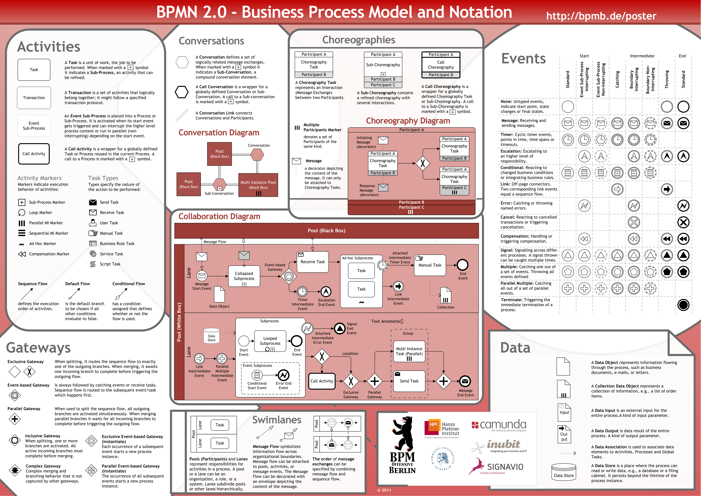
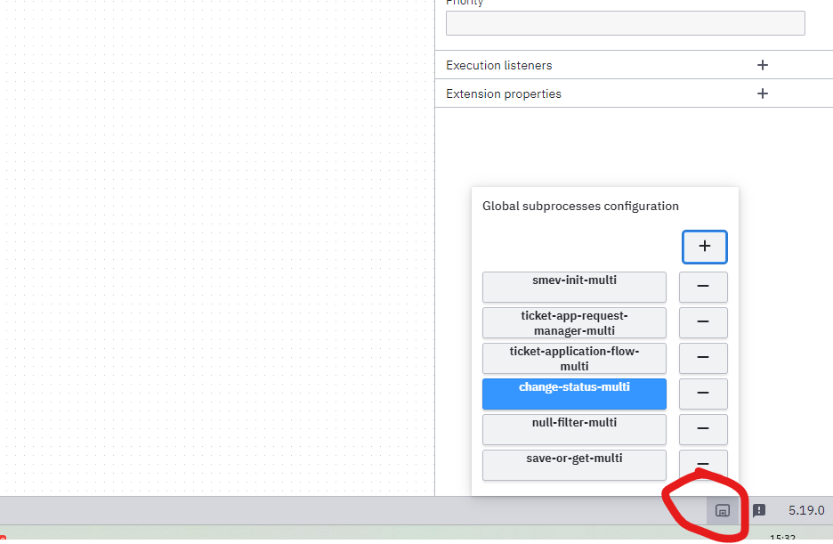

## Постановка на разработку BPMN-диаграмм

Выше дано описание полного цикла процедуры получения Охотбилета на BPMN 2.0 с учетом текущей [архитектуры](https://structurizr.kbinform.ru/workspace/2/documentation). Требуется довести эти диаграммы до рабочего состояния, соответствующему реальному бизнес-процессу. Также в результате станет возможно составить спецификацию [воркеров](https://structurizr.kbinform.ru/workspace/2/documentation/Hunt/Microservice%20Archetype) и сервисных функций (ниже)

### Что понадобится в работе

#### Теория BPMN 2.0

Если опыта в этом мало и все равно потребуется предварительно погружение, сосредоточиться лучше на тех аспектах нотации, которые актуальны для нас больше всего. 

В части компонентов нотации, можно для начала сосредоточиться на тех, что уже есть в наших диаграммах. Большое значение в процессах будут занимать *события* – тут надо разобраться как следует, во всем их зоопарке. 

Хоть BPMN  и открытый формат, каждый вендор его под свою платформу расширяет. Поэтому лучше основным источником туториалов использовать вендора нашего – [Camunda](https://docs.camunda.org/manual/7.20/reference/bpmn20/).

> [!IMPORTANT]
>
> Мы на текущий момент работаем с седьмой Камундой

Из комундовских фичей основополагающую для архитектуры роль играют [**External Tasks**](https://docs.camunda.org/manual/7.20/user-guide/process-engine/external-tasks/). Будучи в BPM-процессе особо не примечательным сортом сервисных задач,на деле это асинхронные эндпоинты, которые и отвечают за управления (ну или вызовы) микросервисов. О них больше инфы с разделе по [воркерам](https://structurizr.kbinform.ru/workspace/2/documentation/Hunt/Microservice%20Archetype#%D0%BD%D0%B0%D0%B7%D0%BD%D0%B0%D1%87%D0%B5%D0%BD%D0%B8%D0%B5-%D0%BC%D0%B8%D0%BA%D1%80%D0%BE%D1%81%D0%B5%D1%80%D0%B2%D0%B8%D1%81%D0%BE%D0%B2).

Второй ключевое понятие Камунды –  [переменные процесса](https://docs.camunda.org/manual/7.20/user-guide/process-engine/variables/). В нашей концепции диаграммы и их задачи – это функции, (причем местами строго типизированные) и потоки данных в системе преимущественно реализованы как передача переменных вдоль процесса (и между).

По теме переменных нужно разобраться в нюансах маппинга, сериализации и Spin-форматах

Что нам **не** потребуется – так это взаимодействовать с движком непосредственно через код, за малым исключением использования `Camunda Java API` в делегатах (один из вариантов реализации сервисных тасков) и скриптовых  тасках

Нужно с точки зрения бизнес-области подумать, как часто в системе могут возникать кейсы с **распределенной транзакцией**. Ниже будут пара статей про паттерн Сага, но пока не очевидно применим ли он в нашем случае.

Наконец –  поскольку одними из первых артефактов этой работы нужны будут [шаблоны BPM-элементов](https://docs.camunda.io/docs/components/modeler/desktop-modeler/element-templates/about-templates/?_gl=1*15ywg1t*_ga*MTM1ODYyNzgzNi4xNzA3NzU5MTkx*_ga_4EYN8X5FNR*MTcwNzc4MDAyNS40LjEuMTcwNzc4MTcxNS41NS4wLjA.), о них конечно тоже нужно узнать, впрочем там все элементарно.

#### Camunda Modeler

В ближайшее время – основной инструмент проектирования процессов. Можно скачать с оф. сайта, но я оставлю тут свою сборку с удобными (и что важно взаимно-совместимыми) плагинами – [Modeler.rar](https://onedrive.live.com/embed?resid=DC53D55E3A363D1B!1428&authkey=!AD4GiCSFg5GyfTw) .

Помимо BPMN, в моделере есть простенький редактор форм ввода – могут в первое время заменять готовую платформу при отладке.

#### Черновые версии BPM-процессов

Собственно начинать работу надо не с чистого листа, а с подготовленных в каркасе процессах. Общая логическая цепочка отображена на диаграмме

Есть два варианта работы

- работать с каждым BPM отдельно. Это ближе к продуктовой реализации – каждый процесс с в отдельном файле [(7 шт)](https://1drv.ms/f/s!Ahs9Njpe1VPcjARfQVEPKWOdUgIY?e=pU8IDJ) 
- использовать [мульти-BPM](https://1drv.ms/u/s!Ahs9Njpe1VPcixEvFmSI4YdX59iz?e=50x3op), все процессы в одном файле. Такая фича от плагина к моделлеру, но с точки зрения нотации это корректно. Если будешь использовать, переключение между процессами внизу справа 

