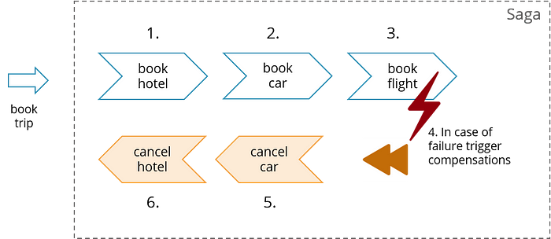
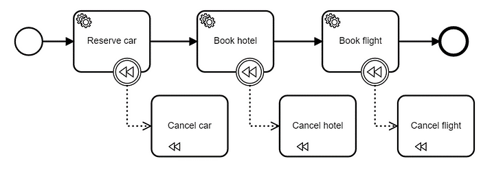
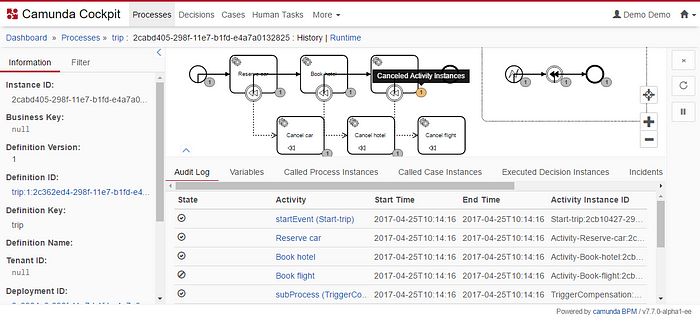

## Сага: Как реализовать сложные бизнес-транзакции без двухфазного подтверждения

### Что такое Сага?

Шаблон Сага описывает, как решить распределенные (бизнес-) транзакции без двухфазного подтверждения, так как это не масштабируется в распределенных системах. Основная идея заключается в разделении общей транзакции на несколько шагов или действий. Только внутри шаги могут быть выполнены в атомарных транзакциях, но общая согласованность обеспечивается Сагой. Сага несет ответственность за завершение общей бизнес-транзакции или оставление системы в известном состоянии завершения. Таким образом, в случае ошибок применяется процедура отката бизнеса, которая выполняется вызовом компенсационных шагов или действий в обратном порядке.

Хороший обзор cаг можно найти в этом ролике:

<iframe src="https://cdn.embedly.com/widgets/media.html?src=https%3A%2F%2Fwww.youtube.com%2Fembed%2F0UTOLRTwOX0%3Ffeature%3Doembed&amp;display_name=YouTube&amp;url=https%3A%2F%2Fwww.youtube.com%2Fwatch%3Fv%3D0UTOLRTwOX0&amp;image=https%3A%2F%2Fi.ytimg.com%2Fvi%2F0UTOLRTwOX0%2Fhqdefault.jpg&amp;key=a19fcc184b9711e1b4764040d3dc5c07&amp;type=text%2Fhtml&amp;schema=youtube" allowfullscreen="" frameborder="0" height="480" width="854" title="Distributed Sagas: A Protocol for Coordinating Microservices - Caitie McCaffrey - JOTB17" class="fp n gf dv bg" scrolling="no" style="box-sizing: inherit; top: 0px; width: 680px; height: 382.188px; left: 0px;"></iframe>

Классическим примером является бронирование поездки:

Шаблон набирает все большую популярность в последнее время, поскольку системы становятся все более сложными, распределенными и удаленными — таким образом, "хорошо известные" ACID-транзакции, наконец, достигли своего предела. Оригинальный шаблон Сага, кстати, довольно [стар](https://www.cs.cornell.edu/andru/cs711/2002fa/reading/sagas.pdf).

При доменно-ориентированно подходе к проектированию, этот шаблон хорошо известен, так как его нужно применять сразу, как только у вас появляются кейсы, включающие взаимодействие нескольких ограниченных контекстов. В микросервисной архитектуре он менее известен, но необходим в тех случаях, когда общий поток включает в себя несколько сервисов.

### Как реализовать Сагу?

Сага включает обработку состояния, так как вам нужно помнить, что вы уже сделали, чтобы, возможно, выполнить компенсационные действия. Поэтому Сага — это долгий поток выполнения, ощутимый во времени человеком (в противовес скоростям в миллион операций в секунду).

И вот тут как нельзя кстати подходит язык BPMN. Приведенный выше пример можно моделировать следующим образом:

Модель может быть непосредственно выполнена соответствующим движком, без нужды хардкодить. Компенсационные действия связаны с соответствующим им действиям основного процесса. Таким образом, рабочий процесс, способный к BPMN, может выступать в качестве Координатора Саги!

Кому интересно, можно ознакомиться с [рабочим примером приложения на GitHub](https://github.com/flowing/flowing-trip-booking-saga). За авторством, кстати, основателя Камунды.

