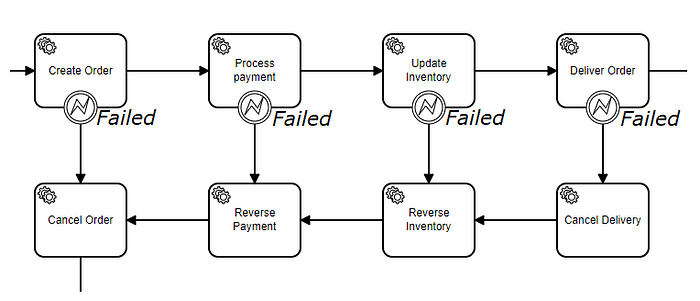
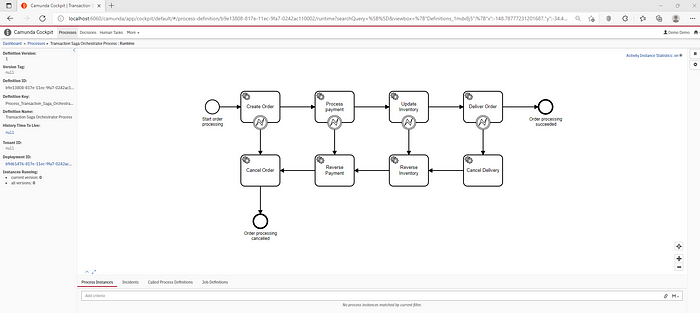
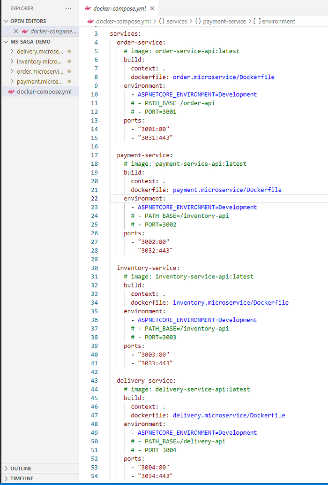
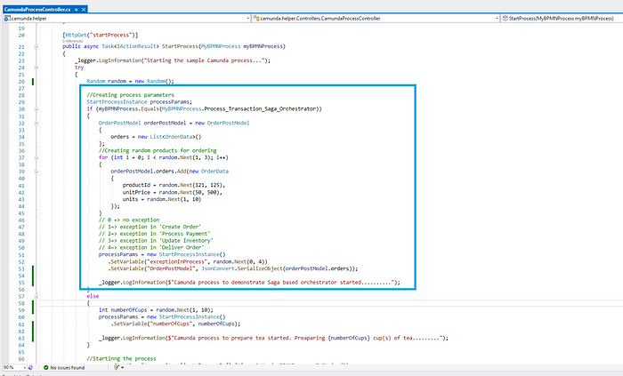
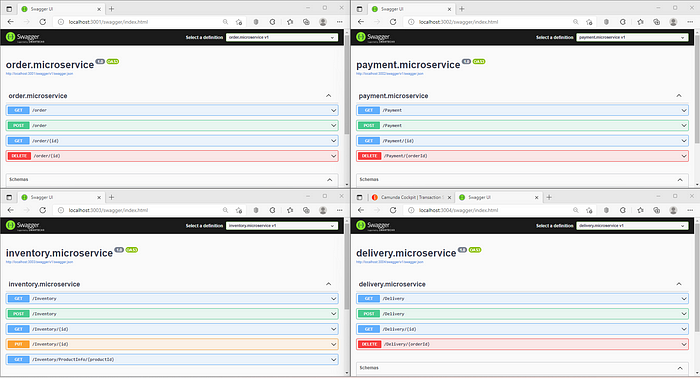

## Оркестрация микросервисов по шаблону Сага, используя Camunda (описание примера)

Микросервисы больше не являются просто модным словом для разработчиков и архитекторов. В мире микросервисов часто обработка одного запроса может потребовать взаимодействия с несколькими сервисами. В такой распределенной системе каждый сервис может иметь свою собственную базу данных. Как тогда обеспечить согласованность данных в пределах запроса?

**[Шаблон Saga](https://microservices.io/patterns/data/saga.html)** – это ответ на вопрос о согласованности данных в микросервисах при распределенных транзакциях. Это транзакции, которые охватывают несколько микросервисов. Они успешно выполняются до конца, или если что-то идет не так, они полностью откатываются. Таким образом, они работают по принципу "все или ничего", что обеспечивает согласованность данных между микросервисами. 

От создания заказа до его доставки все действия выполняется одно за другим для завершения успешной транзакции. Но если что-то идет не так, например, при доставке заказа или обновлении инвентаря, запускается набор транзакций для аннулирования/отмены всей транзакции, которая началась с создания заказа. Эти транзакции (Отменить заказ, Отменить платеж, Отменить инвентарь, Отменить доставку) известны как компенсационные транзакции, которые отменяют изменения, внесенные предшествующими транзакциями.

Существует два способа реализации шаблона **Saga**:

**Хореография**: В хореографии локальная транзакция публикует событие домена, которое запускает локальную транзакцию в других сервисах.

**Оркестрация**: В оркестрации есть централизованный контроллер, который сообщает участникам, какие локальные транзакции выполнить.

### Демо-приложение

Для демонстрации оркестрации саги создано четыре образца микросервисов: заказ, оплата, инвентаризация и доставка. Все эти микросервисы – это минимальные веб-API, созданные с использованием **dotnet**. Можно запускать их отдельно или в Docker. 

- Это очень простое приложение, где все эти четыре службы выполняют свои операции, специфичные для предметной области
- Затем используется движок Camunda для выполнения оркестрации
- Существует еще одно API на основе dotnet: *camunda-helper*, в котором реализованы все обработчики, используемые Camunda для выполнения операций. Эти обработчики в свою очередь вызывают соответствующие (специфичные для домена) микросервисы. 

На приведенной выше схеме BPMN показана диаграмма, которая показывает транзакцию, начиная с создания заказа и заканчивая его доставкой. Вся транзакция состоит из четырех локальных транзакций, и у каждой из них есть одна компенсационная транзакция. Либо данный заказ обрабатывается успешно, либо откатывается и отменяется, чтобы сохранить согласованность локальных баз данных.

Шаги для запуска приложения:

- Запустите скрипт *"start-camunda.ps1"*, упомянутый [здесь](https://github.com/satyampushkar/camunda.demo.process/tree/main/Infrastructure), чтобы запустить экземпляр `Camunda на Docker-desktop.`
- Разверните "*Transaction Saga Orchestrator Process.bpmn"* в движке **Camunda** с помощью **Camunda Modeler** или Rest API.

   

- Запустите файл *'docker-compose.yml'*, находящийся в папке *'camunda.demo.process/ms-saga-demo/'*, чтобы запустить все экземпляры микросервисов.

   

- Вы также можете запустить их на локальной машине
- Запустите API 'camunda-helper', который откроет Swagger.
- Выберите опцию *"Process_Transaction_Saga_Orchestrator"*, чтобы запустить процесс. Для демонстрации возможностей  исключения  генерируются случайно из всех локальных транзакций. Нужно запустить процесс несколько раз, чтобы увидеть разные потоки.

Ниже вы можете увидеть снимок экрана запущенных всех микросервисов. Прежде чем начать тестирование, вам нужно добавить товары на склад. Вы можете использовать скрипт *'Add-Items-to-Inventory.ps1'*, чтобы добавить некоторые продукты на склад

После того как  выберете опцию *"Process_Transaction_Saga_Orchestrator"* после запуска `'camunda-helper'`, вы увидите отличающиеся результаты