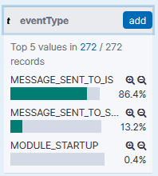
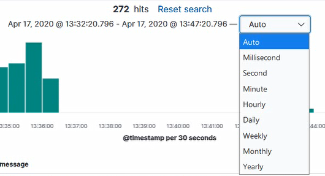

# Шпаргалка по форматам Адаптера СМЭВ

## Описание Протокола Взаимодействия (структур данных отправки запросов и ответов на запросы)

**Перечень входных и выходных параметров метода отправки запросов и ответов на запросы**

| **Название**                           | **Тип**   | **NOT NULL** | **KEY**               | **Описание**                                                 |
| :------------------------------------- | :-------- | :----------- | :-------------------- | :----------------------------------------------------------- |
| **Входные данные REST API Интерфейса** |           |              |                       |                                                              |
| Псевдоним ИС                           | string    | Да           | itSystem              | Буквенно-числовой код ИС для определения Транспорта СМЭВ 3 при взаимодействии |
| Очередь                                | string    | Да           | replyToQueue          | Наименование очереди для отправки ответа                     |
| Запрос                                 | Контейнер | Да           | requestMessage        | Описание отправляемого запроса                               |
| Тип сообщения                          | string    | Да           | messageType           | Тип сообщения: REQUEST                                       |
| Метаданные запроса                     | Контейнер | Да           | requestMetadata       | Метаданные запроса                                           |
| Уникальный идентификатор запроса       | varchar   | Да           | clientId              | Уникальный идентификатор запроса                             |
| Контент отправляемого запроса          | Контейнер | Да           | requestContent        | Контент отправляемого запроса                                |
| -                                      | Контейнер | Да           | content               | -                                                            |
| -                                      | Контейнер | Да           | messagePrimaryContent | -                                                            |
| Бизнес-данные запроса                  | varchar   | Да           | any                   | Бизнес-данные запроса, сформированные по XSD-схеме вида сведений в формате XML |
| **Выходные данные**                    |           |              |                       |                                                              |
| Данные синхронного ответного сообщения | Контейнер | Да           | MessageResult         | - Псевдоним ИС<br />- Идентификатор отправленного сообщения  |
| Псевдоним ИС                           | String    | Да           | ItSystem              | Буквенно-числовой код ИС для определения Транспорта СМЭВ 3 при взаимодействии. Строка не превышает 1500 символов. |
| Идентификатор отправленного сообщения  | UUID      | Да           | MessageId             | Идентификатор отправленного сообщения, сгенерированный в соответствии с RFC-4122, по варианту 1 (на основании MAC-адреса и текущего времени). |
| Ошибка ИУА                             | Контейнер | Да           | SystemFault           | - Код ошибки<br /> - Описание ошибки.                        |
| Ошибка обработки сообщения ИУА         | Контейнер | Да           | ValidationFault       | - Код ошибки<br />- Описание ошибки                          |

**Пример минимального сообщения в формате JSON для отправки запроса:**

```json
{
	"itSystem": "ATKIS1 _t00smev2",
	"replyToQueue": "ATKIS2",
	"requestMessage": {
		"messageType": "RequestMessageType",
		"requestMetadata": {
			"clientId": "1009f24d-077e-26e0-bfc7-2c467a429232"
		},
		"requestContent": {
			"content": {
				"messagePrimaryContent": {
					"any": "<ns:DataRequest Id='REQ_1' xmlns:ns='urn://adapter_atc/1.0.1'><ns:Request>simple request</ns:Request></ns:DataRequest>"
				}
			}
		}
	}
}
```

**Пример минимального сообщения в формате JSON для отправки ответа на запрос:**
```json
{
	"itSystem": "ATKIS2_t00smev2",
	"replyToQueue": "ATKIS2",
	"responseMessage": {
		"messageType": "ResponseMessageType",
		"responseMetadata": {
			"clientId": "4447f23d-077e-26e0-bfc7-2c467a429232",
			"replyToClientId": "f42cf596-9676-4b12-91ce-b7236c25e68b"
		},
		"responseContent": {
			"content": {
				"messagePrimaryContent": {
					"any": "<ns:DataResponse Id='REQ_1' xmlns:ns='urn://adapter_atc/1.0.1'><ns:Response>simple response from adapter</ns:Response></ns:DataResponse>"
				}
			}
		}
	}
}
```

**Пример максимального сообщения в формате JSON для отправки запроса:**
```json
{
  "itSystem": "string",
  "replyToQueue": "string",
  "requestMessage": {
    "messageType": "RequestMessageType",
    "requestMetadata": {
      "clientId": "4445f23d-077e-26e0-bfc7-2c467a429232",
      "linkedGroupIdentity": {
        "refClientId": "4445f23d-077e-26e0-bfc7-2c467a429232",
        "refGroupId": "4445f23d-077e-26e0-bfc7-2c467a429232"
      },
      "createGroupIdentity": {
        "frguServiceCode": "string",
        "frguServiceDescription": "string",
        "frguServiceRecipientDescription": "string"
      },
      "nodeId": "4445f23d-077e-26e0-bfc7-2c467a429232",
      "eol": "2021-11-19T11:30:08.600Z",
      "testMessage": true,
      "transactionCode": "string",
      "businessProcessMetadata": {
        "businessProcessMetadataList": [
          "string"
        ]
      },
      "routingInformation": {
        "dynamicRouting": {
          "dynamicValue": [
            "string"
          ]
        },
        "identifierRouting": {
          "identifierValue": [
            "string"
          ]
        },
        "registryRouting": {
          "registryRecordRouting": [
            {
              "recordId": 5,
              "useGeneralRouting": true,
              "dynamicRouting": {
                "dynamicValue": [
                  "string"
                ]
              },
              "identifierRouting": {
                "identifierValue": [ "string" ]
              }
            }
          ]
        }
      }
    },
    "requestContent": {
      "content": {
        "messagePrimaryContent": {
          "any": "string"
        },
        "personalSignature": {
          "signature": "string"
        },
        "attachmentHeaderList": {
          "attachmentHeader": [
            {
              "id": "4445f23d-077e-26e0-bfc7-2c467a429232",
              "filePath": "string",
              "passportId": "string",
              "signaturePKCS7": " ",
              "transferMethod": "MTOM",
              "reusableAttachment": true,
              "archive": {
                "file": [
                  {
                    "name": "string",
                    "passportId": "4445f23d-077e-26e0-bfc7-2c467a429232"
                  }
                ]
              }
            }
          ]
        }
      },
      "originalContent": "string"
    }
  },
"queryMessage": {
    "messageType": "QueryMessageType",
    "clientId": "string",
    "nodeId": "4445f23d-077e-26e0-bfc7-2c467a429232",
    "queryType": "REQUEST",
    "queryFilter": "string",
    "queryRootTag": "string"
  }
}
```

**Пример максимального сообщения в формате JSON для отправки ответа на запрос:**

```json
{
	"itSystem": "string",
	"replyToQueue": "string",
	"requestMessage": {
		"messageType": "RequestMessageType",
		"requestMetadata": {
			"clientId": "4445f23d-077e-26e0-bfc7-2c467a429232",
			"linkedGroupIdentity": {
				"refClientId": "4445f23d-077e-26e0-bfc7-2c467a429232",
				"refGroupId": "4445f23d-077e-26e0-bfc7-2c467a429232"
			},
			"createGroupIdentity": {
				"frguServiceCode": "string",
				"frguServiceDescription": "string",
				"frguServiceRecipientDescription": "string"
			},
			"nodeId": "4445f23d-077e-26e0-bfc7-2c467a429232",
			"eol": "2021-11-19T11:30:08.600Z",
			"testMessage": true,
			"transactionCode": "string",
			"businessProcessMetadata": {
				"businessProcessMetadataList": [
					"string"
				]
			},
			"routingInformation": {
				"dynamicRouting": {
					"dynamicValue": [
						"string"
					]
				},
				"identifierRouting": {
					"identifierValue": [
						"string"
					]
				},
				"registryRouting": {
					"registryRecordRouting": [
						{
							"recordId": 5,
							"useGeneralRouting": true,
							"dynamicRouting": {
								"dynamicValue": [
									"string"
								]
							},
							"identifierRouting": {
								"identifierValue": [
									"string"
								]
							}
						}
					]
				}
			}
		},
		"requestContent": {
			"content": {
				"messagePrimaryContent": {
					"any": "string"
				},
				"personalSignature": {
					"signature": "string"
				},
				"attachmentHeaderList": {
					"attachmentHeader": [
						{
							"id": "4445f23d-077e-26e0-bfc7-2c467a429232",
							"filePath": "string",
							"passportId": "string",
							"signaturePKCS7": " ",
							"transferMethod": "MTOM",
							"reusableAttachment": true,
							"archive": {
								"file": [
									{
										"name": "string",
										"passportId": "4445f23d-077e-26e0-bfc7-2c467a429232"
									}
								]
							}
						}
					]
				}
			},
			"originalContent": "string"
		}
	},
	"queryMessage": {
		"messageType": "QueryMessageType",
		"clientId": "string",
		"nodeId": "4445f23d-077e-26e0-bfc7-2c467a429232",
		"queryType": "REQUEST",
		"queryFilter": "string",
		"queryRootTag": "string"
	}
}
```

**Пример возвращаемого ответа:**

```json
{
    "itSystem": "ATKIS1_t00smev2",
    "messageId": "4df5b480-6187-11ec-ae79-e4115b50d3da"
}
```

#### Описание структур данных сообщений на получение из ИУА запросов и ответов на запросы

| **Название**                                       | **Тип**   | **not null** | **KEY**             | **Описание**                                                 |
| :------------------------------------------------- | :-------- | :----------- | :------------------ | :----------------------------------------------------------- |
| Данные запроса сообщения                           | Контейнер | Да           | MessageQuery        | - Блок критериального запроса<br />- Идентификатор узла отправителя запроса<br />- Регистрационный код ИС УВ в ИУА |
| Регистрационный код ИС УВ в ИУА                    | String    | Да           | itSystem            | Включает уникальный мнемонический код, который присваивается ИС УВ при ее регистрации в ИУА. Строка не превышает 50 символов. |
| Идентификатор узла отправителя запроса             | String    | Нет          | NodeID              | Строка не превышает 50 символов.                             |
| Блок запроса по клиентскому идентификатору запроса | Контейнер | Нет          | specificQuery       | Получение одного сообщения из ИУА по его типу.               |
| Получение сообщения из ИУА по его типу             | Контейнер | Да           | messageTypeCriteria | Включает вариант запроса сообщения                           |
| Вариант запроса сообщения                          | Enum      | Да           | TypeCriteria        | - RESPONSE (Вариант получения очередного ответа)<br />- REQUEST (Вариант получения очередного запроса). |
| **Входные данные REST API интерфейса**             |           |              |                     |                                                              |
| Мнемоника ИС                                       | string    | Да           | itSystem            | Код ИС в ИУА                                                 |
| Мнемоника узла ИС                                  | string    | Нет          | nodeId              | Код определенного узла ИС в ИУА                              |
| Очередь                                            | string    | Нет          | routerExtraQueue    | Наименование очереди для получения ответа на запрос          |
| Сведения о типе сообщения                          |           | Нет          | specificQuery       |                                                              |
| Тип сообщения                                      | string    | Нет          | messageTypeCriteria | - REQUEST – запрос<br />- RESPONSE – ответ.                  |
| **Выходные данные**                                |           |              |                     |                                                              |
| Ответ на запрос с сообщением                       | Контейнер | Да           | QueryResult         | - Метаданные сообщения из СМЭВ<br />- Сообщение.             |
| Ответ с сообщением                                 | Контейнер | Да           | Message             | - Запрос<br />- Ответ на запрос<br />- Статусное сообщение<br />- Ошибка отправки сообщения через СМЭВ 3 |
| Ошибка отправки сообщения через СМЭВ 3.            | Контейнер | Да           | ErrorMessage        | - Метаданные статусного сообщения<br />- Тип статусного сообщения<br />- Описание статуса<br />- Метка времени формирования статуса<br />- Сведения об ошибке. |
| Статусное сообщение                                | Контейнер | Да           | StatusMessage       | - Метаданные статусного сообщения<br />- Тип статусного сообщения<br />- Описание статуса<br />- Метка времени формирования статуса |
| Ошибка ИУА                                         | Контейнер | Да           | SystemFault         | - Код ошибки<br />- Описание ошибки                          |
| Ошибка обработки сообщения ИУА                     | Контейнер | Да           | ValidationFault     | - Код ошибки<br />- Описание ошибки                          |

**Пример минимального запроса в формате JSON для получения сообщения для информационной системы:**
```json
{
  "itSystem": "ATKIS2"
}
```

**Пример максимального запроса в формате JSON для получения сообщения для информационной системы:**
```json
{
  "itSystem": "ATKIS2",
  "nodeId": "node2",
  "routerExtraQueue": "node2_receive_queue",
  "specificQuery": {
    "messageTypeCriteria": "REQUEST"
  }
}
```

**Пример возвращаемого ответа:**
```json
{
    "smevMetadata": {
        "messageId": "b46a4d2e-6186-11ec-ae79-e4115b50d3da",
        "transactionCode": "b4aad90e-6186-11ec-87eb-fa163e0257bd|00000000000000000000|GggFAfFsiTSsDRqkbwcKWPOUujndovXywky9/0w75p+JUYy5HF8Pv8EOHlmUW6XLDBIGMI2f1ukQUNze35mdBUgRaL1Nf7QiTxPdiLDUyyydTv6TX2tdsBnK7OMDidR+jB54OABD9KU09mVn2Nrz4Kdud9tUId6MMsWbEpgPo69swyMhmb/1yugjAE90uFzarHSyGHqUcY5liKZtH42KwBoGCCew+ciiCBWlHROFG7IEisrl/Ay6b0E20JT8UOt3rNntMzaE1+/zZxrAdWpqFSDb5zUIwaTEa9xQLpCDxNMgng13CBi2JmYbXUYOWU66iqOsZFaxcO/QjdLz2Cp/LA==",
        "sender": "ATKIS1",
        "recipient": "ATKIS2"
    },
    "message": {
        "requestMetadata": {
            "clientId": "f42cf596-9676-4b12-91ce-b7236c25e68b",
            "linkedGroupIdentity": {
                "refClientId": "f42cf596-9676-4b12-91ce-b7236c25e68b",
                "refGroupId": "b4aad90e-6186-11ec-87eb-fa163e0257bd"
            },
            "testMessage": false,
            "transactionCode": "b4aad90e-6186-11ec-87eb-fa163e0257bd|00000000000000000000|GggFAfFsiTSsDRqkbwcKWPOUujndovXywky9/0w75p+JUYy5HF8Pv8EOHlmUW6XLDBIGMI2f1ukQUNze35mdBUgRaL1Nf7QiTxPdiLDUyyydTv6TX2tdsBnK7OMDidR+jB54OABD9KU09mVn2Nrz4Kdud9tUId6MMsWbEpgPo69swyMhmb/1yugjAE90uFzarHSyGHqUcY5liKZtH42KwBoGCCew+ciiCBWlHROFG7IEisrl/Ay6b0E20JT8UOt3rNntMzaE1+/zZxrAdWpqFSDb5zUIwaTEa9xQLpCDxNMgng13CBi2JmYbXUYOWU66iqOsZFaxcO/QjdLz2Cp/LA=="
        },
        "requestContent": {
            "content": {
                "messagePrimaryContent": {
                    "any": "<?xml version=\"1.0\" encoding=\"UTF-8\" standalone=\"no\"?><ns:DataRequest xmlns:ns=\"urn://adapter_atc/1.0.1\" xmlns=\"urn://x-artefacts-smev-gov-ru/services/message-exchange/types/1.3\" xmlns:S=\"http://schemas.xmlsoap.org/soap/envelope/\" xmlns:SOAP-ENV=\"http://schemas.xmlsoap.org/soap/envelope/\" xmlns:ds=\"http://www.w3.org/2000/09/xmldsig#\" xmlns:ns0=\"urn://x-artefacts-smev-gov-ru/services/message-exchange/types/1.3\" xmlns:ns1=\"urn://x-artefacts-smev-gov-ru/services/message-exchange/types/basic/1.3\" xmlns:ns2=\"urn://x-artefacts-smev-gov-ru/services/message-exchange/types/basic/1.3\" xmlns:ns3=\"urn://x-artefacts-smev-gov-ru/services/message-exchange/types/faults/1.3\" xmlns:ns4=\"urn://x-artefacts-smev-gov-ru/services/message-exchange/types/routing/1.3\" Id=\"REQ_1\"><ns:Request>simple request</ns:Request></ns:DataRequest>"
                }
            }
        }
    }
}
```

#### Описание структур данных поиска сообщений в ИУА
**Перечень входных и выходных данных метода «Find» web-сервиса**

| **Название**                                       | **Тип**     | **not null** | **KEY**                 | **Описание**                                                 |
| :------------------------------------------------- | :---------- | :----------- | :---------------------- | :----------------------------------------------------------- |
| **Входные данные REST API Интерфейса**             |             |              |                         |                                                              |
| Регистрационный код ИС УВ в ИУА                    | String      | Да           | isSystem                | Включает уникальный мнемонический код, который присваивается ИС УВ при ее регистрации в ИУА. Строка не превышает 50 символов. |
| Блок запроса по клиентскому идентификатору запроса | Контейнер   | Да           | specificQuery           | - Получение сообщений из ИУА за заданный период<br />- Получение сообщения из ИУА по его идентификатору. |
| Получение сообщений из ИУА за заданный период      | Контейнер   | Да           | messagePeriodCriteria   | Включает временной диапазон, за который необходимо получить сообщения. При поиске сообщений за заданный временной диапазон используется время сохранения сообщения в БД ИУА. |
| От                                                 | dateTime    | Да           | from                    | Метка времени, от которой искать сообщения. Если не указан //to, то возвращаются все найденные сообщения начиная с //from |
| До                                                 | dateTime    | Нет          | to                      | Метка времени, до которой искать сообщения.                  |
| Получение сообщения из ИУА по его идентификатору   | Контейнер   | Да           | messageClientIdCriteria | - Идентификатор сообщения<br />- Вариант запроса сообщения по его идентификатору |
| Идентификатор сообщения                            | String      | Да           | clientId                | Клиентский идентификатор запроса, ранее сформированного и отправленного ИС УВ в ИУА. |
| Вариант запроса сообщения по его идентификатору    | Enum        | Да           | clientIdCriteria        | - GET\_REQUEST\_BY\_REQUEST\_CLIENTID (Получить запрос по клиентскому идентификатору запроса)<br />- GET\_RESPONSE\_BY\_RESPONSE\_CLIENTID (Получить ответы на запрос по клиентскому идентификатору ответа на запрос)<br />- GET\_RESPONSE\_BY\_REQUEST\_CLIENTID (Получить ответ на запрос по клиентскому идентификатору запроса). |
| Количество сообщений                               | Целое число | Да           | MessageCountToReturn    | Количество сообщений, удовлетворяющих критериям поиска, которое необходимо вернуть |
| От сообщения с порядковым номером                  | Целое число | Да           | MessageOffset           | Необходимо последовательно возвращать указанное в MessageCountToReturn  количество, начиная с сообщения с порядковым номером, указанным в MessageOffset, относительно всех сообщений, удовлетворяющих критериям поиска |
| **Выходные данные**                                |             |              |                         |                                                              |
| Ответ на запрос с сообщениями                      | Контейнер   | Да           | QueryResultList         | - Ответ на запрос с сообщением.                              |
| Ответ на запрос с сообщением                       | Контейнер   | Да           | QueryResult             | - Запрос<br />- Ответ на запрос<br />- Статусное сообщение<br />- Ошибка отправки сообщения через СМЭВ 3 |
| Ошибка ИУА                                         | Контейнер   | Да           | SystemFault             | - Код ошибки<br />- Описание ошибки                          |
| Ошибка обработки сообщения ИУА                     | Контейнер   | Да           | ValidationFault         | - Код ошибки<br />- Описание ошибки                          |

**Пример минимального запроса в формате JSON для поиска сообщений, удовлетворяющих условиям, среди всех сообщений для информационной системы:**
```json
{
	"itSystem": "ATKIS1",
	"specificQuery": {
		"messageClientIdCriteria": {
			"clientId": "225bc981-b8fe-4bb5-bba2-8ea56ee97de1",
			"clientIdCriteria": "GET\_REQUEST\_BY\_REQUEST\_CLIENTID"
		}
	}
}
```

**Пример максимального запроса в формате JSON для поиска сообщений, удовлетворяющих условиям, среди всех сообщений для информационной системы:**
```json
{
	"itSystem": "string",
	"specificQuery": {
		"messagePeriodCriteria": {
			"from": "2021-11-23T00:07:40.456Z",
			"to": "2021-11-23T00:07:40.456Z"
		},
		"messageClientIdCriteria": {
			"clientId": "string",
			"clientIdCriteria": "GET\_REQUEST\_BY\_REQUEST\_CLIENTID"
		},
		"messageCountToReturn": 3,
		"messageOffset": 0
	}

```

**Пример возвращаемого ответа:**
```json
{
	"queryResult": [
		{
			"smevMetadata": {
				"messageId": "d532d451-6187-11ec-ae79-e4115b50d3da",
				"transactionCode": "b4aad90e-6186-11ec-87eb-fa163e0257bd|00000000000000000000|GggFAfFsiTSsDRqkbwcKWPOUujndovXywky9/0w75p+JUYy5HF8Pv8EOHlmUW6XLDBIGMI2f1ukQUNze35mdBUgRaL1Nf7QiTxPdiLDUyyydTv6TX2tdsBnK7OMDidR+jB54OABD9KU09mVn2Nrz4Kdud9tUId6MMsWbEpgPo69swyMhmb/1yugjAE90uFzarHSyGHqUcY5liKZtH42KwBoGCCew+ciiCBWlHROFG7IEisrl/Ay6b0E20JT8UOt3rNntMzaE1+/zZxrAdWpqFSDb5zUIwaTEa9xQLpCDxNMgng13CBi2JmYbXUYOWU66iqOsZFaxcO/QjdLz2Cp/LA==",
				"originalMessageID": "b46a4d2e-6186-11ec-ae79-e4115b50d3da",
				"sender": "ATKIS2",
				"recipient": "ATKIS1",
				"sendingDate": "2021-12-20T11:27:36.683Z"
			},
			"message": {
				"messageType": "PrimaryMessage",
				"responseMetadata": {
					"clientId": "4445f23d-077e-26e0-bfc7-2c467a429232",
					"replyToClientId": "f42cf596-9676-4b12-91ce-b7236c25e68b"
				},
				"responseContent": {
					"content": {
						"messagePrimaryContent": {
							"any": "<ns:DataResponse Id='REQ_1' xmlns:ns='urn://adapter_atc/1.0.1'><ns:Response>simple response from adapter</ns:Response></ns:DataResponse>"
						}
					}
				}
			}
		},
		{
			"smevMetadata": {
				"messageId": "f30721b4-6188-11ec-ae79-e4115b50d3da",
				"transactionCode": "b4aad90e-6186-11ec-87eb-fa163e0257bd|00000000000000000000|GggFAfFsiTSsDRqkbwcKWPOUujndovXywky9/0w75p+JUYy5HF8Pv8EOHlmUW6XLDBIGMI2f1ukQUNze35mdBUgRaL1Nf7QiTxPdiLDUyyydTv6TX2tdsBnK7OMDidR+jB54OABD9KU09mVn2Nrz4Kdud9tUId6MMsWbEpgPo69swyMhmb/1yugjAE90uFzarHSyGHqUcY5liKZtH42KwBoGCCew+ciiCBWlHROFG7IEisrl/Ay6b0E20JT8UOt3rNntMzaE1+/zZxrAdWpqFSDb5zUIwaTEa9xQLpCDxNMgng13CBi2JmYbXUYOWU66iqOsZFaxcO/QjdLz2Cp/LA==",
				"originalMessageID": "b46a4d2e-6186-11ec-ae79-e4115b50d3da",
				"sender": "ATKIS2",
				"recipient": "ATKIS1",
				"sendingDate": "2021-12-20T11:35:36.235Z"
			},
			"message": {
				"messageType": "PrimaryMessage",
				"responseMetadata": {
					"clientId": "4446f23d-077e-26e0-bfc7-2c467a429232",
					"replyToClientId": "f42cf596-9676-4b12-91ce-b7236c25e68b"
				},
				"responseContent": {
					"content": {
						"messagePrimaryContent": {
							"any": "<ns:DataResponse Id='REQ_1' xmlns:ns='urn://adapter_atc/1.0.1'><ns:Response>simple response from adapter</ns:Response></ns:DataResponse>"
						}
					}
				}
			}
		},
		{
			"smevMetadata": {
				"messageId": "f537e465-6188-11ec-ae79-e4115b50d3da",
				"transactionCode": "b4aad90e-6186-11ec-87eb-fa163e0257bd|00000000000000000000|GggFAfFsiTSsDRqkbwcKWPOUujndovXywky9/0w75p+JUYy5HF8Pv8EOHlmUW6XLDBIGMI2f1ukQUNze35mdBUgRaL1Nf7QiTxPdiLDUyyydTv6TX2tdsBnK7OMDidR+jB54OABD9KU09mVn2Nrz4Kdud9tUId6MMsWbEpgPo69swyMhmb/1yugjAE90uFzarHSyGHqUcY5liKZtH42KwBoGCCew+ciiCBWlHROFG7IEisrl/Ay6b0E20JT8UOt3rNntMzaE1+/zZxrAdWpqFSDb5zUIwaTEa9xQLpCDxNMgng13CBi2JmYbXUYOWU66iqOsZFaxcO/QjdLz2Cp/LA==",
				"originalMessageID": "b46a4d2e-6186-11ec-ae79-e4115b50d3da",
				"sender": "ATKIS2",
				"recipient": "ATKIS1",
				"sendingDate": "2021-12-20T11:35:39.911Z"
			},
			"message": {
				"messageType": "PrimaryMessage",
				"responseMetadata": {
					"clientId": "4447f23d-077e-26e0-bfc7-2c467a429232",
					"replyToClientId": "f42cf596-9676-4b12-91ce-b7236c25e68b"
				},
				"responseContent": {
					"content": {
						"messagePrimaryContent": {
							"any": "<ns:DataResponse Id='REQ_1' xmlns:ns='urn://adapter_atc/1.0.1'><ns:Response>simple response from adapter</ns:Response></ns:DataResponse>"
						}
					}
				}
			}
		}
	]
}
```

## Плагины конвертации данных обменов СМЭВ
Для упрощения процедур интеграции информационных систем участников взаимодействия со СМЭВ 3, Адаптер предоставляет возможность отправки и приема сообщений в формате, предусматривающем обмен только бизнес-данными по обменам, для которых реализованны плагины, по протоколу REST API.

Для добавления плагина необходимо в меню выбрать пункт «Настройка плагинов». На странице «Плагины» нажать кнопку «Добавить» и заполнить поля:

«Шаблон» - выбрать шаблон плагина, соответствующий необходимому обмену

«Мнемоника плагина» - произвольный уникальный идентификатор создаваемого плагина, который будет использоваться для маршрутизации при обращении по REST API

«Информационная система» - выбрать предварительно созданную ИС, посредством которой плагин будет осуществлять взаимодействие со СМЭВ 3

«Псевдоним ИС» - выбрать предварительно добавленный Псевдоним ИС для подключению к транспорту, посредством которого плагин будет осуществлять взаимодействие со СМЭВ 3

«Узел ИС» - опциональный параметр, включающий маршрутизацию сообщений с использованием узла ИС

«Комментарий» - произвольный комментарий

«Активен» - переключатель признака доступности плагина

Для обмена сообщениями посредством плагинов в Адаптере реализованы следующие методы REST API, доступные по адресу http://localhost:7590/plugin/{метод}:

\- Метод «Send», обеспечивающий отправку запросов в СМЭВ 3;

\- Метод «Get», обеспечивающий прием из Адаптера СМЭВ 3 ответов на запросы;

\- Метод «Find», обеспечивающий поиск сообщений в Адаптере СМЭВ 3.х.

**Перечень входных и выходных параметров метода «Send»**

| **Название**                                                 | **Тип**   | **NOT null** | **key**        | **Описание**                                                 |
| :----------------------------------------------------------- | :-------- | :----------- | :------------- | :----------------------------------------------------------- |
| **Входные данные метода «Send» REST API интерфейса**         |           |              |                |                                                              |
| Мнемоника экземпляра плагина                                 | string    | Да           | pluginMnemonic | Мнемоника экземпляра плагина СМЭВ, используемого для отправки запроса |
| Локальный идентификатор запроса                              | string    | Нет          | clientId       | Локальный идентификатор запроса. При отсутствии будет сгенерирован Адаптером. |
| Признак тестового сообщения                                  | bool      | Нет          | testMessage    | -true<br>-false                                              |
| Контент отправляемого запроса                                | Контейнер | Да           | requestContent | Содержит специфичный для используемого плагина набор элементов |
| **Выходные данные метода «Send» REST API интерфейса при успешном размещении запроса в очереди на отправку (HTTP status code 200)** |           |              |                |                                                              |
| Локальный идентификатор запроса                              | string    | Да           | clientId       | Локальный идентификатор запроса. Равен соответствующему значению запроса. При отсутствии в запросе, генерируется Адаптером. |
| Идентификатор отправленного в СМЭВ запроса                   | UUID      | Да           | MessageId      | Идентификатор отправленного в СМЭВ сообщения, сгенерированный в соответствии с RFC-4122, по варианту 1 |
| **Выходные данные метода «Send» REST API интерфейса в случае возникновения ошибки обработки запроса Адаптером СМЭВ по причине отсутствия в запросе данных необходимых для его обработки либо наличия в запросе неконсистентных данных (HTTP status code 400)** |           |              |                |                                                              |
| Описание ошибки                                              | string    | Да           | error          |                                                              |
| **Выходные данные метода «Send» REST API интерфейса в случае возникновения программного сбоя (HTTP status code 500)** |           |              |                |                                                              |
| Описание ошибки                                              | string    | Да           | error          |                                                              |


**Перечень входных и выходных параметров метода «Get»**

| **Название**                                                 | **Тип**   | **nto null** | key             | **Описание**                                                 |
| :----------------------------------------------------------- | :-------- | :----------- | :-------------- | :----------------------------------------------------------- |
| **Входные данные метода «Get» REST API интерфейса**          |           |              |                 |                                                              |
| Мнемоника экземпляра плагина                                 | string    | Да           | pluginMnemonic  | Мнемоника экземпляра плагина СМЭВ, из входящей очереди которого необходимо вычитать сообщение |
| **Выходные данные метода «Get» REST API интерфейса в случае успешного чтения входящего ответа из очереди (HTTP status code 200), при условии наличия в очереди не вычитанных сообщений** |           |              |                 |                                                              |
| Локальный идентификатор ответа                               | string    | Да           | clientId        | Локальный идентификатор ответа. Генерируется при получении ответа. |
| Идентификатор запроса, которым инициирован получаемый ответ  | string    | Да           | replyToClientId | Локальный идентификатор запроса, которым инициирован получаемый ответ. Предназначен для связывания полученного ответа с ранее отправленным запросом |
| Идентификатор принятого из СМЭВ ответа                       | UUID      | Да           | messageId       | Идентификатор принятого из СМЭВ сообщения                    |
| Контент полученного ответа                                   | Контейнер | Да           | responseContent | Содержит специфичный для используемого плагина набор элементов |
| **Выходные данные метода «Get» REST API интерфейса в случае успешной попытки чтения входящего ответа из очереди (HTTP status code 200), при условии отсутствия в очереди не вычитанных сообщений** |           |              |                 |                                                              |
| В теле возвращается пустое значение                          |           |              |                 |                                                              |
| **Выходные данные метода «Get» REST API интерфейса в случае возникновения ошибки обработки запроса Адаптером СМЭВ по причине отсутствия в запросе данных необходимых для его обработки либо наличия в запросе неконсистентных данных (HTTP status code 400)** |           |              |                 |                                                              |
| Описание ошибки                                              | string    | Да           | error           |                                                              |
| **Выходные данные метода «Get» REST API интерфейса в случае возникновения программного сбоя (HTTP status code 500)** |           |              |                 |                                                              |
| Описание ошибки                                              | string    | Да           | error           |                                                              |


**Перечень входных и выходных параметров метода «Find»**

| **Название**                                                 | **Тип**     | **NOT NULL** | **KEY**                 | **Описание**                                                 |
| :----------------------------------------------------------- | :---------- | :----------- | :---------------------- | :----------------------------------------------------------- |
| **Входные данные метода «Find» REST API интерфейса**         |             |              |                         |                                                              |
| Мнемоника экземпляра плагина                                 | string      | Да           | pluginMnemonic          | Мнемоника экземпляра плагина СМЭВ, из входящей очереди которого необходимо вычитать сообщение |
| Критерий поиска по временному диапазону                      | Контейнер   | Нет          | messagePeriodCriteria   | Включает временной диапазон, за который необходимо получить сообщения. При поиске сообщений за заданный временной диапазон используется время сохранения сообщения в БД ИУА. |
| Начало периода                                               | dateTime    | Да           | from                    | Метка времени, от которой искать сообщения. Если не указан //to, то возвращаются все найденные сообщения начиная с //from |
| Конец периода                                                | dateTime    | Нет          | to                      | Метка времени, до которой искать сообщения.                  |
| Критерий поиска по идентификатору сообщения                  | Контейнер   | Нет          | messageClientIdCriteria | -Идентификатор сообщения<br />-Вариант запроса сообщения по его идентификатору |
| Идентификатор сообщения                                      | String      | Да           | clientId                | Клиентский идентификатор запроса, ранее сформированного и отправленного ИС УВ в ИУА. |
| Вариант запроса сообщения по его идентификатору              | Enum        | Да           | clientIdCriteria        | - GET\_REQUEST\_BY\_REQUEST\_CLIENTID (Получить запрос по клиентскому идентификатору запроса)<br /> - GET\_RESPONSE\_BY\_RESPONSE\_CLIENTID (Получить ответы на запрос по клиентскому идентификатору ответа на запрос)<br /> - GET\_RESPONSE\_BY\_REQUEST\_CLIENTID (Получить ответ на запрос по клиентскому идентификатору запроса). |
| Количество сообщений                                         | Целое число | Нет          | messageCountToReturn    | Количество сообщений, удовлетворяющих критериям поиска, которое необходимо вернуть |
| От сообщения с порядковым номером                            | Целое число | Нет          | messageOffset           | Необходимо последовательно возвращать указанное в MessageCountToReturn  количество, начиная с сообщения с порядковым номером, указанным в MessageOffset, относительно всех сообщений, удовлетворяющих критериям поиска |
| **Выходные данные метода «Find» REST API интерфейса в случае успешного завершения поиска сообщений (HTTP status code 200)** |             |              |                         |                                                              |
| Тип сообщения                                                | Enum        | Да           | messageType             | REQUEST, RESPONSE                                            |
| Локальный идентификатор ответа                               | string      | Да           | clientId                | Локальный идентификатор ответа. Генерируется при получении ответа. |
| Идентификатор запроса, которым инициирован получаемый ответ  | string      | Да           | replyToClientId         | Локальный идентификатор запроса, которым инициирован получаемый ответ. Предназначен для связывания полученного ответа с ранее отправленным запросом |
| Идентификатор принятого из СМЭВ ответа                       | UUID        | Да           | messageId               | Идентификатор принятого из СМЭВ сообщения                    |
| Контент сообщения                                            | Контейнер   | Да           | messageContent          | Содержит специфичный для используемого плагина набор элементов запроса или ответа |
| Блок вложений                                                | Контейнер   | Нет          | AttachmentHeaderList    |                                                              |
| Описание вложения                                            | Контейнер   | Да           | AttachmentHeader        |                                                              |
| Идентификатор вложения                                       | string      | Да           | id                      |                                                              |
| Метод передачи вложения                                      | enum        | Да           | transferMethod          | MTOM, REFERENCE                                              |
| Путь и имя файла                                             | string      | Да           | filePath                |                                                              |
| ЭЦП ЭП-СП                                                    | string      |              | signaturePKCS7          | ЭЦП в формате PKCS#7 detached. Подписываемая ключом ЭП-СП    |
| **Выходные данные метода «Find» REST API интерфейса в случае возникновения ошибки обработки запроса Адаптером СМЭВ по причине отсутствия в запросе данных необходимых для его обработки либо наличия в запросе неконсистентных данных (HTTP status code 400)** |             |              |                         |                                                              |
| Описание ошибки                                              | string      | Да           | error                   |                                                              |
| **Выходные данные метода «Find» REST API интерфейса в случае возникновения программного сбоя (HTTP status code 500)** |             |              |                         |                                                              |
| Описание ошибки                                              | string      | Да           | error                   |                                                              |

### Плагин «Проверка действительности Паспорта Гражданина РФ по серии и номеру»

**Структура бизнес-данных контейнера «requestContent» метода Send**

| **№** | **Название**   | **Тип** | **Обязательность** | **Обозначение** | **Описание** |
|:------|:---------------|:--------|:-------------------|:----------------|:-------------|
| 1     | Серия паспорта | string  | Да                 | series          |              |
| 2     | Номер паспорта | string  | Да                 | number          |              |
| 3     | Дата выдачи    | date    | Да                 | issueDate       |              |

**Пример отправки запроса методом «Send»**

```JSON
{
	"pluginMnemonic": "my-test-plugin",
	"requestContent": {
		"series": "1234",
		"number": "567890",
		"issueDate": "2020-01-01"
	}
}
```

**Пример синхронного ответа на отправку запроса методом «Send»**

```json
{
	"clientId": "104e9eb0-f60d-4daf-9942-29804eb05982",
	"messageId": "ff2d56af-3efe-11ed-a795-0a0027000003",
}
```

**Пример отправки запроса на получения ответа из СМЭВ методом «Get»:**

```json
{
    "pluginMnemonic": "my-test-plugin"
}
```

**Пример ответа в случае, если паспортные данные принадлежат существующему действующему паспорту:**

```json
{
	"clientId": "ad6f6e31-a861-44ad-97f4-6a73b287c135",
	"replyToClientId": "104e9eb0-f60d-4daf-9942-29804eb05982",
	"messageId": "4c565e7c-5bf6-cd89-2531-248c7048f9e6",
	"responseContent": {
		"validDoc": null
	}
}
```

**Пример ответа в случае, если указанные паспортные данные не существуют:**

```json
{
	"clientId": "1781d3ed-5a8e-4eb1-8426-6eed78af221e",
	"replyToClientId": "104e9eb0-f60d-4daf-9942-29804eb05982",
	"messageId": "4c565e7c-5bf6-cd89-2531-248c7048f9e6",
	"responseContent": {
		"notFoundDoc": {
		}
	}
}
```

**Пример ответа в случае, если указанный паспорт не действителен**

```json
{
	"clientId": "104e9eb0-f60d-4daf-9942-29804eb05981",
	"replyToClientId": "104e9eb0-f60d-4daf-9942-29804eb05982",
	"messageId": "4c565e7c-5bf6-cd89-2531-248c7048f9e6",
	"responseContent": {
		"invalidDoc": {
			"invalidityReason": "606",
			"invalidityDate": "2007-10-26"
		}
	}
}
```

### Плагин «Передача статусов и результатов предоставления государственных и муниципальных услуг

JSON-схема отправляемых запросов и получаемых ответов

**Отправка запроса по данным, идентифицирующим заявителя - индивидуального предпринимателя**

```json
{
	"pluginMnemonic": "plugin-pgu-20",
	"requestContent": {
		"env": "EPGU",
		"requestType": "CreateOrdersRequest",
		"orders": [
			{
				"organization": {
					"ogrnInnIp": {
						"ogrn": "300000000000000",
						"inn": "000000000000"
					}
				},
				"serviceTargetCode": "string",
				"orderNumber": "string",
				"userSelectedRegion": "12345678",
				"requestDate": "2014-09-19T03:18:33Z",
				"senderKpp": "123456789",
				"senderInn": "1234567890",
				"officeInfo": {
					"applicationAcceptance": 1
				},
				"statusHistoryList": [
					{
						"status": 1,
						"isInformed": true,
						"statusDate": "2021-11-01T08:36:46+03:00",
						"attachments": [
							{
								"filePath": "pgu.create-request.xml",
								"docTypeId": "ELK_RESULT"
							}
						]
					}
				]
			}
		]
	}
}

```

**Отправка запроса по данным, идентифицирующим заявителя - юридическое лицо:**

```json
{
    "pluginMnemonic": "plugin-pgu-20",
    "requestContent": {
      "env": "EPGU",
      "requestType": "CreateOrdersRequest",
      "orders": [
        {
          "organization": {
            "ogrnInnUl": {
              "innKpp": {
                "inn": "0000000000"
              }
            }
          },
          "serviceTargetCode": "string",
          "orderNumber": "string",
          "userSelectedRegion": "12345678",
          "requestDate": "2014-09-19T03:18:33Z",
          "senderKpp": "123456789",
          "senderInn": "1234567890",
          "officeInfo": {
            "applicationAcceptance": 1
          },
          "statusHistoryList": [
            {
              "status": 1,
              "isInformed": true,
              "statusDate": "2021-11-01T08:36:46+03:00",
              "attachments": [
                {
                  "filePath": "pgu.create-request.xml",
                  "docTypeId": "ELK_RESULT"
                }
              ]
            }
          ]
        }
      ]
    }
}
```

**Отправка запроса по данным заявителя (ЮЛ / ИП):**

```json
{
    "pluginMnemonic": "plugin-pgu-20",
    "requestContent": {
        "env": "EPGU",
        "requestType": "CreateOrdersRequest",
        "orders": [
            {
                "orgId": "string1-20",
                "serviceTargetCode": "string",
                "orderNumber": "string",
                "userSelectedRegion": "12345678",
                "requestDate": "2014-09-19T03:18:33Z",
                "senderKpp": "123456789",
                "senderInn": "1234567890",
                "officeInfo": {
                    "applicationAcceptance": 1
                },
                "statusHistoryList": [
                    {
                        "status": 1,
                        "isInformed": true,
                        "statusDate": "2021-11-01T08:36:46+03:00",
                        "attachments": [
                            {
                                "filePath": "test.pdf",
                                "docTypeId": "ELK_RESULT"
                            }
                        ]
                    }
                ]
            }
        ]
    }
}
```

где:
**orgId** - Идентификатор организации в ЕСИА (ЮЛ / ИП)

**Отправка запроса по данным заявителя с обязательным указанием номера записи единого федерального информационного регистра, содержащего сведения о населении Российской Федерации:**

```json
{
    "pluginMnemonic": "plugin-pgu-20",
    "requestContent": {
        "env": "EPGU",
        "requestType": "CreateOrdersRequest",
        "orders": [
            {
                "user": {
                    "ernId": "000000000000"
                },
                "serviceTargetCode": "string",
                "orderNumber": "string",
                "userSelectedRegion": "12345678",
                "requestDate": "2014-09-19T03:18:33Z",
                "senderKpp": "123456789",
                "senderInn": "1234567890",
                "officeInfo": {
                    "applicationAcceptance": 1
                },
                "statusHistoryList": [
                    {
                        "status": 1,
                        "isInformed": true,
                        "statusDate": "2021-11-01T08:36:46+03:00",
                        "attachments": [
                            {
                                "filePath": "test.pdf",
                                "docTypeId": "ELK_RESULT"
                            }
                        ]
                    }
                ]
            }
        ]
    }
}
```

**Отправка запроса по данным заявителя с обязательным указанием идентификатора заявителя в ЕСИА (ФЛ):**

```json
{
    "pluginMnemonic": "plugin-pgu-20",
    "requestContent": {
        "env": "EPGU",
        "requestType": "CreateOrdersRequest",
        "orders": [
            {
                "user": {
                    "esiaId": "string"
                },
                "serviceTargetCode": "string",
                "orderNumber": "string",
                "userSelectedRegion": "12345678",
                "requestDate": "2014-09-19T03:18:33Z",
                "senderKpp": "123456789",
                "senderInn": "1234567890",
                "officeInfo": {
                    "applicationAcceptance": 1
                },
                "statusHistoryList": [
                    {
                        "status": 1,
                        "isInformed": true,
                        "statusDate": "2021-11-01T08:36:46+03:00",
                        "attachments": [
                            {
                                "filePath": "test.pdf",
                                "docTypeId": "ELK_RESULT"
                            }
                        ]
                    }
                ]
            }
        ]
    }
}
```

**Отправка запроса по данным заявителя с обязательным указанием ИНН:**

```json
{
    "pluginMnemonic": "plugin-pgu-20",
    "requestContent": {
        "env": "EPGU",
        "requestType": "CreateOrdersRequest",
        "orders": [
            {
                "user": {
                    "userDocInn": {
                        "inn": "string-14",
                        "lastName": "string-256",
                        "firstName": "string-256",
                        "middleName": "string-256",
                        "citizenship": 1
                    }
                },
                "serviceTargetCode": "string",
                "orderNumber": "string",
                "userSelectedRegion": "12345678",
                "requestDate": "2014-09-19T03:18:33Z",
                "senderKpp": "123456789",
                "senderInn": "1234567890",
                "officeInfo": {
                    "applicationAcceptance": 1
                },
                "statusHistoryList": [
                    {
                        "status": 1,
                        "isInformed": true,
                        "statusDate": "2021-11-01T08:36:46+03:00",
                        "attachments": [
                            {
                                "filePath": "test.pdf",
                                "docTypeId": "ELK_RESULT"
                            }
                        ]
                    }
                ]
            }
        ]
    }
}
```

**Отправка запроса по данным заявителя с обязательным указанием СНИЛС:**

```json
{
    "pluginMnemonic": "plugin-pgu-20",
    "requestContent": {
        "env": "EPGU",
        "requestType": "CreateOrdersRequest",
        "orders": [
            {
                "user": {
                    "userDocSnils": {
                        "snils": "string-14",
                        "lastName": "string-256",
                        "firstName": "string-256",
                        "citizenship": 1
                    }
                },
                "serviceTargetCode": "string",
                "orderNumber": "string",
                "userSelectedRegion": "12345678",
                "requestDate": "2014-09-19T03:18:33Z",
                "senderKpp": "123456789",
                "senderInn": "1234567890",
                "officeInfo": {
                    "officeName": "string",
                    "applicationAcceptance": 1
                },
                "statusHistoryList": [
                    {
                        "status": 1,
                        "isInformed": true,
                        "statusDate": "2021-11-01T08:36:46+03:00",
                        "attachments": [
                            {
                                "filePath": "test.pdf",
                                "docTypeId": "ELK_RESULT"
                            }
                        ]
                    }
                ]
            }
        ]
    }
}
```

**Отправка запроса по данным заявителя с обязательным указанием СНИЛС и даты рождения:**

```json
{
  "pluginMnemonic": "plugin-pgu-20",
  "requestContent": {
    "env": "EPGU",
    "requestType": "CreateOrdersRequest",
    "orders": [
      {
        "user": {
          "userDocSnilsBirthDate": {
            "citizenship": 5,
            "snils": "00000000000000",
            "birthDate": "2014-09-19"
          }
        },
        "serviceTargetCode": "string",
        "orderNumber": "string",
        "userSelectedRegion": "12345678",
        "requestDate": "2014-09-19T03:18:33Z",
        "senderKpp": "123456789",
        "senderInn": "1234567890",
        "officeInfo": {
          "officeName": "string",
          "applicationAcceptance": 1
        },
        "statusHistoryList": [
          {
            "status": 1,
            "isInformed": true,
            "statusDate": "2021-11-01T08:36:46+03:00",
            "attachments": [
              {
                "filePath": "test.pdf",
                "docTypeId": "ELK_RESULT"
              }
            ]
          }
        ]
      }
    ]
  }
}
```

**Отправка запроса по данным заявителя с обязательным указанием типа документа удостоверяющего личность:**

```json
{
	"pluginMnemonic": "plugin-pgu-20",
	"requestContent": {
		"env": "EPGU",
		"requestType": "CreateOrdersRequest",
		"orders": [
			{
				"user": {
					"userPersonalDoc": {
						"personalDocType": 1,
						"series": "string",
						"number": "string",
						"lastName": "string",
						"firstName": "string",
						"citizenship": 1
					}
				},
				"serviceTargetCode": "string",
				"orderNumber": "string",
				"userSelectedRegion": "12345678",
				"requestDate": "2014-09-19T03:18:33Z",
				"senderKpp": "123456789",
				"senderInn": "1234567890",
				"officeInfo": {
					"officeName": "string",
					"applicationAcceptance": 1
				},
				"statusHistoryList": [
					{
						"status": 1,
						"isInformed": true,
						"statusDate": "2021-11-01T08:36:46+03:00",
						"attachments": [
							{
								"filePath": "test.pdf",
								"docTypeId": "ELK_RESULT"
							}
						]
					}
				]
			}
		]
	}
}
```

**Обновление статуса по данным номера заявления в ЛК ЕПГУ**

```json
{
	"pluginMnemonic": "plugin-pgu-20",
	"requestContent": {
		"env": "EPGU",
		"requestType": "UpdateOrdersRequest",
		"orders": [
			{
				"elkOrderNumber": 1,
				"senderKpp": "123456789",
				"senderInn": "1234567890",
				"statusHistoryList": [
					{
						"status": 1,
						"isInformed": true,
						"statusDate": "2021-11-01T08:36:46+03:00",
						"attachments": [
							{
								"filePath": "test.pdf",
								"docTypeId": "ELK_RESULT"
							}
						]
					}
				]
			}
		]
	}
}

```

**Обновление статуса по данным номера заявления пользователя во внешней ИС:**

```json
{
	"pluginMnemonic": "plugin-pgu-20",
	"requestContent": {
		"env": "EPGU",
		"requestType": "UpdateOrdersRequest",
		"orders": [
			{
				"orderNumber": "string1-36",
				"senderKpp": "123456789",
				"senderInn": "1234567890",
				"statusHistoryList": [
					{
						"status": 1,
						"isInformed": true,
						"statusDate": "2021-11-01T08:36:46+03:00",
						"attachments": [
							{
								"filePath": "test.pdf",
								"docTypeId": "ELK_RESULT"
							}
						]
					}
				]
			}
		]
	}
}

```

**При заполнении представленных в сообщениях элементов, необходимо использовать следующие справочники и значения:**

| Наименование элемента | Описание                                                     |
| :-------------------- | :----------------------------------------------------------- |
| pluginMnemonic        | Мнемоника (наименование) созданного пользователем экземпляра плагина, через который должен быть отправлен запрос |
| env                   | Код маршрутизации. Для продуктивной версии должно быть указано значение «EPGU», для тестовой значение «SVCDEV» |
| requestType           | Тип запроса:«CreateOrdersRequest» -создание нового статуса«UpdateOrdersRequest» -обновление существующего, ранее созданного статуса |
| serviceTargetCode     | Идентификатор цели обращения (подуслуги) в ФРГУ/КЦР          |
| orderNumber           | Номер заявления пользователя во внешней ИС                   |
| userSelectedRegion    | Местоположение заявителя по ОКТМО (Допустимо указание до уровня региона. В случае подачи заявления в электронном виде указывать 00000000) |
| requestDate           | Дата и время подачи заявления                                |
| senderKpp             | КПП организации отправителя                                  |
| senderInn             | ИНН организации отправителя                                  |
| officeName            | Наименование офиса, через который был подано заявление       |
|                       |                                                              |
| isInformed            | Признак того, что заявитель уже проинформирован о статусе своего заявления |
| statusDate            | Дата и время изменения статуса                               |
| filePath              | Путь до файла отправляемого вложения                         |
| docTypeId             | Справочник ЕСНСИ "ЕЛК. Типы документов (вложений)"<https://esnsi.gosuslugi.ru/classifiers/7246> |
| citizenship           | Справочник ЕСНСИ "ЕЛК. Гражданство"<https://esnsi.gosuslugi.ru/classifiers/7210> |
| personalDocType       | Справочник ЕСНСИ "ЕЛК. Тип документа удостоверяющего личность"<https://esnsi.gosuslugi.ru/classifiers/7211> |
| applicationAcceptance | Справочник ЕСНСИ "ЕЛК. Канал приема"<https://esnsi.gosuslugi.ru/classifiers/7213> |
| status                | Справочник ЕСНСИ "ЕЛК. Статусы"<https://esnsi.gosuslugi.ru/classifiers/7212> |
| messageType           | Справочник ЕСНСИ "ЕЛК. Шаблоны уведомлений"<https://esnsi.gosuslugi.ru/classifiers/7293> |


### Плагин «Универсальный сервис отправки сообщений пользователям ЕПГУ государственной почтовой системы (ГЭПС)

**Структура бизнес-данных контейнера «requestContent» метода Send**

| **Название**                                                 | **Тип**            | **NOT NULL** | **KEY**                        | **Описание**                                                 |
| :----------------------------------------------------------- | :----------------- | :----------- | :----------------------------- | :----------------------------------------------------------- |
| Вспомогательный ID запроса                                   | string             | Нет          | requestId                      | Вспомогательный ID запроса. Не использовать при отправке сообщений на реальных пользователей |
| Общий блок реестрового запроса                               | Контейнер          | Да           | generalData                    |                                                              |
| Внешний идентификатор ФОИВ                                   | string             | Нет          | foivId                         |                                                              |
| Параметры реестрового запроса                                | Контейнер          | Нет          | settings                       | Параметры реестрового запроса (период, неообходимость сбора реестровых ответов) |
| Признак необходимости получения уведомлений о прочтении в ФОИВ | boolean            | Нет          | readingNotification            |                                                              |
| Период времени в течение которого собирается реестр ответа (каждые 2 часа (часы)) | duration           | Нет          | periodRegistryCollect          | Интервал времени определяется в формате "PnYnMnDTnHnMnS" , где:- P указывает период (обязателен)- nY указывает число лет- nM указывает число месяцев- nD указывает число дней- T указывает на начало раздела с временем (обязателен, если будут определяться часы, минуты или секунды)- nH указывает количество часов- nM указывает количество минут- nS указывает количество секунд&emsp; |
| Период времени в течение которого действует сбор реестров ответов (в течение года (дни)) | duration           | Нет          | periodTimeRegistryCollectValid | Интервал времени определяется в формате "PnYnMnDTnHnMnS"     |
| Параметры отправки повторных уведомлений                     | Контейнер          | Нет          | reNotice                       | Параметры отправки повторных уведомлений (количество повторных уведомлений, период повторных уведомлений) |
| Количество повторных уведомлений                             | integer            | Нет          | countReNotice                  |                                                              |
| Период повторных уведомлений                                 | duration           | Нет          | periodReNotice                 | Интервал времени определяется в формате "PnYnMnDTnHnMnS"     |
| Мнемоника шаблона сообщения                                  | string             | Да           | messageType                    |                                                              |
| Блок с реестровыми сообщениями                               | Массив контейнеров | Да           | registry                       | Реестровый тип данных (для директивных ВВС)                  |
| Уникальный идентификатор записи реестра                      | integer            | Да           | recordId                       |                                                              |
| Реестровая запись                                            | Контейнер          | Да           | record                         |                                                              |
| Аттрибут ID, данных записи                                   | string             | Да           | id                             |                                                              |
| Бизнес-данные записи (аналог MessagePrimaryContent)          | Контейнер          | Да           | recordContent                  |                                                              |
| Аттрибут ID, бизнес-данных                                   | string             | Да           | id                             |                                                              |
| Запрос передачи сообщения между ФОИВ и ГЭПС                  | Контейнер          | Да           | content                        |                                                              |
| Идентификаторы Пользователя, кому отправляется сообщение     | Контейнер          | Да           | user                           |                                                              |
| Тип Пользователя                                             | string             | Да           | userType                       | "PHYSICAL\_PERSON",<br />"SOLE\_PROPRIETOR", <br />"LEGAL\_PERSON" |
| Идентификаторы Пользователя, кому отправляется сообщение     | Контейнер          | Да           | identifiers                    | Содержит набор значений вида:" identifier": {"name1": "value1",  "name2":"value2"                                    }, |
| Параметр сообщения для рендера по шаблону                    | Контейнер          | Да           | params                         | Содержит значения вида "name1": "value1"                     |
| Список файлов, приложенных к СМЭВ-сообщению                  | Контейнер          | Нет          | attachmentHeaderList           | Список файлов, приложенных к СМЭВ-сообщению, при передаче методом MTOM |
| Путь к файлу                                                 | string             | Да           | filePath                       |                                                              |
| Имя файла                                                    | string             | Да           | fileName                       |                                                              |
| Тип контента                                                 | string             | Да           | mimeType                       |                                                              |
| Неймспейс вложения                                           | string             | Нет          | namespaceUri                   | Неймспейс вложения (если зарегистрировано в СМЭВ)            |
| ЭЦП                                                          | string             | Нет          | signaturePKCS7                 | ЭЦП в формате PKCS#7 detached. Подписывать ключом ЭП-СП      |
| Список файлов, приложенных к СМЭВ-сообщению                  | Контейнер          | Нет          | refAttachmentHeaderList        | Список файлов, приложенных к СМЭВ-сообщению, при передаче методом REFERENCE |
| Путь к файлу                                                 | string             | Да           | filePath                       |                                                              |
| Имя файла                                                    | string             | Да           | fileName                       |                                                              |
| Тип контента                                                 | string             | Да           | mimeType                       |                                                              |
| Неймспейс вложения                                           | string             | Нет          | namespaceUri                   | Неймспейс вложения (если зарегистрировано в СМЭВ)            |
| Хэш файла                                                    | string             | Да           | hash                           |                                                              |
| ЭЦП                                                          | string             | Нет          | signaturePKCS7                 | ЭЦП в формате PKCS#7 detached. Подписывать ключом ЭП-СП      |
| ЭП-СП, подписан элемент //RecordContent                      | string             | Нет          | personalSignature              |                                                              |


**Структура бизнес-данных контейнера «responseContent» метода Get**

| **Название**                                             | **Тип**            | **not null** | **key**              | **Описание**                                                 |
| -------------------------------------------------------- | ------------------ | ------------ | -------------------- | ------------------------------------------------------------ |
| Общий блок реестрового запроса                           | Контейнер          | Да           | generalData          | Блок общих сведений о реестре                                |
| Внешний идентификатор ФОИВ                               | string             | Нет          | foivId               |                                                              |
| Блок с реестровыми сообщениями                           | Массив контейнеров | Да           | registry             | Реестровый тип данных (для директивных ВВС)                  |
| Уникальный идентификатор записи реестра                  | integer            | Да           | recordId             |                                                              |
| Реестровая запись                                        | Контейнер          | Да           | record               |                                                              |
| Аттрибут ID, данных записи                               | string             | Да           | id                   |                                                              |
| Бизнес-данные записи (аналог MessagePrimaryContent)      | Контейнер          | Да           | recordContent        |                                                              |
| Аттрибут ID, бизнес-данных                               | string             | Да           | id                   |                                                              |
| Запрос передачи сообщения между ФОИВ и ГЭПС              | Контейнер          | Да           | content              |                                                              |
| Идентификаторы Пользователя, кому отправляется сообщение | Контейнер          | Да           | user                 |                                                              |
| Тип Пользователя                                         | string             | Да           | userType             | "PHYSICAL\_PERSON",<br /> "SOLE\_PROPRIETOR", <br />"LEGAL\_PERSON" |
| Идентификаторы Пользователя, кому отправляется сообщение | Контейнер          | Да           | identifiers          | Содержит набор значений вида `"identifier": {"name1": "value1", "name2":"value2"}` |
| Расшифровка кода ответа                                  | string             | Да           | code                 |                                                              |
| Сообщение статуса                                        | string             | Да           | statusMessage        |                                                              |
| Код статуса                                              | string             | Да           | statusCode           | "ACCEPT",<br />"REJECT",<br />"READ"                         |
| Список файлов, приложенных к СМЭВ-сообщению              | Контейнер          | Нет          | attachmentHeaderList |                                                              |
| Путь к файлу                                             | string             | Да           | filePath             |                                                              |
| Имя файла                                                | string             | Да           | fileName             |                                                              |
| Тип контента                                             | string             | Да           | mimeType             |                                                              |
| Неймспейс вложения                                       | string             | Нет          | namespaceUri         | Неймспейс вложения (если зарегистрировано в СМЭВ)            |
| ЭЦП                                                      | string             | Нет          | signaturePKCS7       | ЭЦП в формате PKCS#7 detached. Подписывать ключом ЭП-СП      |
| ЭП-СП, подписан элемент //RecordContent                  | string             | Нет          | personalSignature    |                                                              |

**Пример отправки методом Send минимального конверта**

```json
{
	"pluginMnemonic": "IT1RT08PL",
	"routingInformation": {
		"registryRouting": {
			"registryRecordRouting": [
				{
					"recordId": 1,
					"useGeneralRouting": false,
					"dynamicRouting": {
						"dynamicValue": [
							"code07"
						]
					}
				}
			]
		}
	},
	"requestContent": {
		"generalData": {
			"messageType": "SDVG"
		},
		"registry": [
			{
				"recordId": 1,
				"record": {
					"recordContent": {
						"content": {
							"user": {
								"userType": "SOLE\_PROPRIETOR",
								"identifiers": {
									"GepsUserId": {
										"GepsUserId": "1234567890"
									}
								}
							}
						}
					}
				}
			}
		]
	}
}
```

**Пример отправки методом Send конверта c вложением**

```json
{
	"pluginMnemonic": "plugin\_mnemonic",
	"clientId": null,
	"testMessage": false,
	"routingInformation": {
		"registryRouting": {
			"registryRecordRouting": [
				{
					"recordId": 1,
					"useGeneralRouting": false,
					"dynamicRouting": {
						"dynamicValue": [
							"code15"
						]
					}
				}
			]
		}
	},
	"requestContent": {
		"requestId": "1",
		"generalData": {
			"foivId": "001",
			"settings": {
				"readingNotification": true,
				"periodRegistryCollect": "P1Y2M3DT10H30M",
				"periodTimeRegistryCollectValid": "P1Y2M3DT10H30M"
			},
			"reNotice": {
				"countReNotice": 3,
				"periodReNotice": "P1Y2M3DT10H30M"
			},
			"messageType": "test-message"
		},
		"registry": [
			{
				"recordId": 1,
				"record": {
					"id": "ID\_1",
					"recordContent": {
						"id": "ID\_2",
						"content": {
							"user": {
								"userType": "PHYSICAL\_PERSON",
								"identifiers": {
									"GepsUserId": {
										"GepsUserId": "1234567890"
									},
									"SNILS": {
										"SNILS": "00000000024"
									},
									"INN": {
										"INN": "034084855570"
									},
									"Passport": {
										"Series": "0002",
										"Number": "123456"
									},
									"STS": {
										"STS": "9919285499"
									},
									"NumberAuto": {
										"NumberAuto": "K881KK777"
									},
									"VIN": {
										"VIN": "WVWZZZ15QEW562589"
									},
									"NameAddress": {
										"LastName": "Иванов",
										"FirstName": "Иван",
										"MiddleName": "Иванович",
										"AddressStr": "123123, г Москва, Пушкинская наб, д 8 стр 3, кв 3",
										"Flat": "3",
										"FiasAddress": "9f9dc1cd-f62c-4c4a-8733-38587f7e8f83",
										"BirthDate": "09.12.1990",
										"PostalCode": "127486"
									}
								}
							},
							"params": {
								"name1": "value1",
								"name2": "value2"
							}
						}
					},
					"attachmentHeaderList": [
						{
							"filePath": "mtom-file.txt",
							"fileName": "mtom-file.txt",
							"mimeType": "text/plain",
							"namespaceUri": "/namespace/mtom-attachment"
						}
					],
					"refAttachmentHeaderList": [
						{
							"fileName": "ref-file.txt",
							"filePath": "ref-file.txt",
							"namespaceUri": "/namespace/ref-attachment",
							"hash": "4g0JzQvtGB0LrQstCwMQsw",
							"mimeType": "text/plain"
						}
					]
				}
			}
		]
	}
}

```

**Пример получения конверта методом get**

```json
{
	"clientId": "9d1f7e8b-9afe-4af9-b0d0-a09fdc307131",
	"replyToClientId": "16d24f02-6c32-4b6f-a097-845c903015e0",
	"messageId": "bdd7cbcb-ce13-11ed-94e5-f4463759f943",
	"responseContent": {
		"registry": [
			{
				"recordId": 1,
				"record": {
					"id": "ID\_1",
					"content": {
						"code": "ACCEPT\_EPGU",
						"id": "ID\_2",
						"user": {
							"identifiers": {
								"NumberAuto": {
									"NumberAuto": "K881KK777"
								},
								"Passport": {
									"Series": "0002",
									"Number": "123456"
								},
								"SNILS": {
									"SNILS": "00000000024"
								},
								"STS": {
									"STS": "9919285499"
								},
								"NameAddress": {
									"FiasAddress": "9f9dc1cd-f62c-4c4a-8733-38587f7e8f83",
									"FirstName": "Иван",
									"Flat": "3",
									"PostalCode": "127486",
									"LastName": "Иванов",
									"MiddleName": "Иванович",
									"AddressStr": "123123, г Москва, Пушкинская наб, д 8 стр 3, кв 3",
									"BirthDate": "09.12.1990"
								},
								"INN": {
									"INN": "034084855570"
								},
								"GepsUserId": {
									"GepsUserId": "1234567890"
								},
								"VIN": {
									"VIN": "WVWZZZ15QEW562589"
								}
							},
							"userType": "PHYSICAL\_PERSON"
						},
						"statusMessage": "string",
						"statusCode": "ACCEPT"
					}
				}
			},
			{
				"recordId": 2,
				"record": {
					"id": "ID\_3",
					"content": {
						"code": "ACCEPT\_EPGU",
						"id": "ID\_4",
						"user": {
							"identifiers": {
								"OGRN": {
									"OGRN": "313344302100137"
								},
								"NameAddress": {
									"FiasAddress": "9f9dc1cd-f62c-4c4a-8733-38587f7e8f83",
									"FirstName": "Иван",
									"Flat": "3",
									"LastName": "Иванов",
									"MiddleName": "Иванович",
									"AddressStr": "123123, г Москва, Пушкинская наб, д 8 стр 3, кв 3"
								},
								"INN": {
									"INN": "123123123123"
								},
								"GepsUserId": {
									"GepsUserId": "1234567892"
								}
							},
							"userType": "SOLE\_PROPRIETOR"
						},
						"statusMessage": "string",
						"statusCode": "ACCEPT"
					}
				}
			}
		],
		"generalData": {
			"foivId": "a"
		}
	}
}

```

## Описание Дополнительных Интерфейсов Администрирования ИУА
### Описание консоли Kubernetes
Администратор ИУА должен уметь выполнять функции администрирования при помощи консоли Kubernetes:
- Масштабирование компонентов ИУА;
- Мониторинг логов.

Подключиться к консоли можно при помощи Token


После авторизации открывается главная страница панели


В поле «Namespace» располагается наименования сервера развертывания ИУА. Во вкладке «Deployments» отображается таблица, в которой хранятся данные о всех запущенных компонентах ИУА. В таблице есть следующие столбцы:

- Name – наименование компонента;
- Labels;
- Pods – количество запущенных компонентов;
- Age – время от последнего перезапуска;
- Images.


Для каждого компонента на странице присутствуют элементы управления:

- Scale – для выполнения масштабирования;
- Edit – Для редактирования настроек компонента;
- Delete – для удаления компонента.

Процесс масштабирования компонента ИУА заключается в создании и запуске нескольких его реплик. Для этого требуется
выбрать необходимый компонент и использовать элемент управления «Scale»


В открывшемся окне ввести количество требуемых реплик и нажать «Scale»


Во вкладке «Pods» отображается таблица, содержащая записи о всех запущенных компонентах ИУА и их репликах. В таблице есть следующие столбцы:

- Name – имя компонента и его ID;
- Labels;
- Node;
- Status;
- Restarts;
- CPU Usage;
- Memory Usage;
- Age – время от последнего перезапуска.


Для каждого компонента на странице присутствуют элементы управления:

- Logs – для просмотра логов;
- Exec;
- Edit – Для редактирования настроек компонента;
- Delete – для удаления компонента.

Для просмотра лог-записей необходимого компонента, требуется найти его в таблице и использовать элеме


На форме просмотра лог-записей предусмотрена возможность скачивания всех записей с момента запуска компонента единым файлом


### **Описание консоли Kibana**

**Kibana** – программная панель просмотра лог-записей и визуализации данных. В процессе использования программы информация, проиндексированная в кластере Elasticsearch, представляется в виде диаграмм различных видов. Внешний вид консоли Kibana после авторизации выглядит следующим образом


В левой части страницы в блоке «Available fields» перечислены доступные поля для выполнения фильтрации лог-записей


При нажатии на фильтр появится список доступных его значений



Выполнить фильтрацию по контенту можно выполнить с помощью поля «Search».

В поле можно ввести известную информацию о контенте сообщения или же можно выбрать из выпадающего списка фильтры, которые также перечислены в блоке “Available fields”.


Предусмотрена возможность фильтрации лог-записей по временным промежуткам


На странице отображается столбчатая диаграмма, показывающая зависимость количества событий, происходящих в ИУА, от
времени. Ее можно масштабировать относительно времени



### **Описание консоли Prometheus**

Prometheus представляет собой комплексное решение, в состав которого входят и фреймворк для мониторинга, и собственная темпоральная база данных. В состав Prometheus входят следующие компоненты:

- сервер, который считывает метрики и сохраняет их в темпоральной (time series) базе данных;
- клиентские библиотеки для различных языков программирования;
- Pushgateway — компонент для приёма метрик кратковременных процессов;
- PROMDASH — dashboard для метрик;
- инструменты для экспорта данных из сторонних приложений.

Главный компонент всей системы — сервер Prometheus. Он работает автономно и сохраняет все данные в локальной базе
данных. Обнаружение сервисов происходит автоматически. Это упрощает процедуру развёртывания: для наблюдения за одним сервисом не нужно разворачивать распределённую систему мониторинга; достаточно установить только сервер и необходимые компоненты для сбора и экспорта метрик.

Внешний вид консоли Prometheus после авторизации выглядит следующим образом


Главная страница «Targets» представляет из себя набор таблиц, отображающих сведения о состоянии всех целей мониторинга (набор endpont’ов, за которыми ведется наблюдение). Для того, чтобы узнать адреса всех конечных точек, с которых снимаются метрики, необходимо перейти по адресу `<хост Prometheus>:<порт Prometheus>/monitoring/prometheus`.

#### **Описание таблиц Prometheus**

| **Название таблицы**         | **Значение**                                                               |
|:-----------------------------|:---------------------------------------------------------------------------|
| kubernetes-apiservers        | Cведения о состоянии master-ноды Kubernetes                                |
| kubernetes-nodes             | Сведения о состоянии нод Kubernetes                                        |
| kubernetes-nodes-cadvisor    | Сведения об анализаторе ресурсов                                           |
| kubernetes-pods              | Сведения о состоянии подов компонентов, развернутых в Kubernetes           |
| kubernetes-service-endpoints | Сведения о состоянии сервисов                                              |
| prometheus                   | Сведения о состоянии Prometheus                                            |
| prometheus-pushgateway       | Сведения о состоянии компонента pushgateway системы мониторинга Prometheus |

Каждая таблица включает в себя следующий набор столбцов:

- Endpoint – адрес конечной точки, с которой снимаются метрики;
- State – состояние конечной точки (Up – активна, Down – не активна);
- Labels – набор меток сервиса для маршрутизации запросов;
- Last Scrape – время в секундах, прошедшее с последнего снятия показаний;
- Scrape Duration – время задержки в мсекх;
- Error – описание ошибки в случае ее возникновения.

Вторая вкладка консоли, необходимая для работы администратора – это «Graph».


Форма предназначена для получения наглядных сведений по снятым метрикам в виде таблиц со значениями или графиков. Для этого в поле «Expression» необходимо ввести значение метрики, сведения по которой мы хотим получить. Полный список метрик доступен администратору по адресу `<хост Prometheus>:<порт Prometheus>/monitoring/metrics`. После ввода значения, необходимо нажать на кнопку «Execute». В разделе «Graph» будет показан график, составленный по снятым метрикам. Пример отображаемого графика приведен на рисунке. В нижней части страницы администратор может ознакомиться с легендой графика. Значения снятых метрик будут собраны в табличном виде в разделе «Table». Пример отображаемой таблицы приведен на рисунке


Администратор имеет возможность изменить временной диапазон отображаемых данных при помощи поля «Evaluation time». Для удобства администратор может использовать следующие check-box:

- Use local time – использовать локальное время;
- Enable autocomplete – автоматически предлагать вариант заполнения поля «Expression» при вводе значения;
- Enable query history – сохранить историю запросов.

## ОПИСАНИЕ НАСТРОЕК
### Описание настроек конфигурации ИУА
**Перечень настроек конфигурации ИУА**

| **№**                                                        | **Наименование настройки**                                   | **Ед. изм.** | **Пример**                               |
| :----------------------------------------------------------- | :----------------------------------------------------------- | :----------- | :--------------------------------------- |
| 1. **Блок настроек «Общие настройки»**                       |                                                              |              |                                          |
| &emsp;                                                       | Идентификатор ИУА                                            | -            | 7ee368be-da4d-4f05-a490-c0b706b54059     |
|                                                              | Наименование службы ИУА                                      | -            | Adapter                                  |
|                                                              | Путь к хранилищу данных                                      | -            | base-storage                             |
|                                                              | Путь к локальному хранилищу данных                           | -            | local-storage                            |
|                                                              | Уровень логирования                                          | -            | INFO                                     |
| 2. **Блок настроек «СМЭВ транспорт»**                        |                                                              |              |                                          |
| &emsp;                                                       | Количество потоков на отправку                               | -            | 10                                       |
| 3. **Блок настроек «Отправка сообщений в СМЭВ»**             |                                                              |              |                                          |
| &emsp;                                                       | Задержка перед началом отправки сообщений (время в мсекх)    | мсек         | 30000                                    |
|                                                              | Периодичность отправки сообщений (время в мсекх)             | мсек         | 60000                                    |
| 4. **Блок настроек «Приём сообщений из СМЭВ»**               |                                                              |              |                                          |
| &emsp;                                                       | Задержка перед началом приема сообщений (время в мсекх)      | мсек         | 30000                                    |
|                                                              | Периодичность приема сообщений (время в мсекх)               | мсек         | 60000                                    |
|                                                              | Количество попыток повторных опросов очереди после получения ошибки | шт.          | 10                                       |
| 5. **Блок настроек «Настройка гарантированной доставки сообщений»** |                                                              |              |                                          |
| &emsp;                                                       | Включение гарантированной доставки                           | -            | true                                     |
|                                                              | Максимальное число попыток доставки сообщения                | шт.          | 4                                        |
|                                                              | Время (в секундах) между попытками доставить сообщение повторно | сек          | 5                                        |
|                                                              | Время (в днях) хранения сообщений гарантированной доставки   | дни          | 7                                        |
|                                                              | Максимальное время обработки сообщений на одном шаге (в секундах) | сек          | 3600                                     |
| 6. **Блок настроек «Модули интеграции»**                     |                                                              |              |                                          |
| &emsp;                                                       | Контекстный путь веб-сервиса                                 | -            | //ws                                     |
|                                                              | Порт веб-сервиса                                             | -            | 7575                                     |
|                                                              | Постоянная доступность веб-сервиса                           | -            | false                                    |
|                                                              | REST API порт                                                | -            | 7590                                     |
| 7. **Блок настроек «Push-уведомления от СМЭВ»**              |                                                              |              |                                          |
| &emsp;                                                       | IP сервиса приема пуш-уведомлений                            | -            | localhost                                |
|                                                              | Порт сервиса приема пуш-уведомлений                          | -            | 7992                                     |
|                                                              | Путь сервиса приема пуш-уведомлений                          | -            | push                                     |
|                                                              | Включение сервиса приема пуш-уведомлений                     | -            | false                                    |
| 8. **Блок настроек «Интенсивность опроса СМЭВ»**             |                                                              |              |                                          |
| &emsp;                                                       | Коэффициент увеличения скорости опроса                       | -            | 3                                        |
| 9. **Блок настроек «ЛК УВ»**                                 |                                                              |              |                                          |
|                                                              | Отключить обращения в ЛК УВ                                  | -            | false                                    |
|                                                              | Адрес                                                        | -            | http://smev.gosuslugi.ru/catalog/adp/mng |
|                                                              | Адрес регистрации ИУА                                        | -            | /registerAdapter                         |
|                                                              | Адрес оповещения об использовании настроечных файлов         | -            | /registerSettingsUsage                   |
|                                                              | Адрес получения списка неиспользуемых настроечных файлов для вида сведений | -            | /getVersionAdapterSettings               |
|                                                              | Адрес получения настроечного файла                           | -            | /getSettings                             |
|                                                              | Адрес получения списка настроечных файлов для обязательной установки | -            | /getMandatorySettings                    |
|                                                              | Заголовок запроса                                            | -            | AdapterCode                              |
|                                                              | Таинственная фраза запроса                                   | -            | AdapterSecret123                         |
|                                                              | Адрес сервиса проверки настроек ФХ                           | -            | /getSettingsFHSMEV                       |
|                                                              | Адрес сервиса получения доступных Узлов ИС                   | -            | /getNodeID                               |
|                                                              | Адрес сервиса получения идентификатора Бланка ПФ             | -            | /sendBlankId                             |
|                                                              | Идентификатор среды СМЭВ                                     | -            | DEV                                      |
| 10. **Блок настроек «Отладка»**                              |                                                              |              |                                          |
| &emsp;                                                       | Проверка работоспособности ЭП-ОВ при старте                  | -            | false                                    |
|                                                              | Сохранение XML сообщений СМЭВ3                               | -            | false                                    |
|                                                              | Очистка содержимого атрибутов                                | -            | false                                    |
| 11. **Блок настроек «Сервис печатных форм»**                 |                                                              |              |                                          |
| &emsp;                                                       | Адрес СПФ                                                    | -            | http://192.168.32.99:8083/api            |
|                                                              | Начальная задержка                                           | мсек         | 30000                                    |
|                                                              | Фиксированная задержка                                       | мсек         | 60000                                    |
|                                                              | Логин                                                        | -            | login1                                   |
|                                                              | Пароль                                                       | -            | password1                                |
| 12. **Настройки многопоточноти**                             |                                                              |              |                                          |
| &emsp;                                                       | Максимальное число потоков                                   | -            | 10                                       |
| 13. **Настройки архивации**                                  |                                                              |              |                                          |
| &emsp;                                                       | Время в часах для архивации сообщений, по которым не было закончено взаимодействие | час          | 336                                      |
|                                                              | Время в секундах после завершения взаимодействия, после которого сообщение можно архивировать | сек          | 86400                                    |
|                                                              | Периодичность архивации (CRON)                               | CRON         | 0 0 0 \* \* \*                           |

### Описание настроек информационной системы ИУА

**Перечень настроек информационной системы ИУА**

| 1. **Блок настроек «Общие настройки»**             |                                                      |       |                                                              |
| :------------------------------------------------- | :--------------------------------------------------- | :---- | :----------------------------------------------------------- |
| &emsp;                                             | Наименование мнемоники информационной системы        | -     | ATKIS1                                                       |
|                                                    | Интерфейс интеграции (способ использования ИУА)      | -     | Web-сервис                                                   |
| 2. **Блок настроек «Подпись»**                     |                                                      |       |                                                              |
| &emsp;                                             | Провайдер                                            |       | JCP2                                                         |
|                                                    | Псевдоним приватного ключа                           |       | c3aa0cff-12a6-42c8-939a-9dc71eb2774f                         |
|                                                    | Пароль приватного ключа                              |       | 1234567890                                                   |
|                                                    | Псевдоним сертификата                                |       | c3aa0cff-12a6-42c8-939a-9dc71eb2774f                         |
|                                                    | Хранилище сертификата                                |       |                                                              |
|                                                    | Тип хранилища ключей                                 |       | «*HDImageStore*» - при использовании хранящегося в виде файлов контейнера ЭП-ОВ<br />«*RutokenStore*» - при использовании одного контейнера «Рутокен»<br />«*RutokenStore\_xxxxxxxx*» - при использовании нескольких контейнеров «Рутокен» |
| 3. **Блок настроек «СМЭВ транспорт»**              |                                                      |       |                                                              |
| &emsp;                                             | Логирование входных данных                           | -     | false                                                        |
|                                                    | Логирование выходных данных                          | -     | false                                                        |
|                                                    | Валидация подписи                                    | -     | true                                                         |
|                                                    | **Настройки подключения транспорта**                 |       |                                                              |
|                                                    | Псевдоним ИС                                         | -     | IT1RT31\_t00smev2                                            |
|                                                    | Адрес                                                | -     | http://smev3-n0.test.gosuslugi.ru:5000/transport\_1\_0\_2/   |
|                                                    | Версия                                               | -     | 1\.3                                                         |
|                                                    | Время в мсекх для установки соединения               | мсек  | 30000                                                        |
| 4. **Блок настроек «Вложения»**                    |                                                      |       |                                                              |
| &emsp;                                             | Способ передачи вложений                             | -     | FTP                                                          |
|                                                    | Логин FTP-сервера                                    | -     | smev                                                         |
|                                                    | Пароль FTP-сервера                                   | -     | anonymous                                                    |
|                                                    | Адрес FTP сервера                                    | -     | ftp://smev3-n0.test.gosuslugi.ru/                            |
|                                                    | Максимальное количество соединений                   | шт.   | 5                                                            |
|                                                    | Время в мсекх для установки соединения               | мсек  | 10000                                                        |
|                                                    | Максимальный размер файлов вложения в байтах (FTP)   | байт  | 100000000                                                    |
|                                                    | Максимальный размер файлов вложения в байтах (МТОМ)  | байт  | 5000000                                                      |
|                                                    | Режим обработки файлов вложений                      | -     | Перемещение                                                  |
| 5. **Блок настроек «Хранилище вложений»**          |                                                      |       |                                                              |
| &emsp;                                             | Тип хранилища вложений                               | **-** | Файловая система                                             |
| 6. **Блок настроек «Приём сообщений из СМЭВ»**     |                                                      |       |                                                              |
| &emsp;                                             | Количество сообщений, забираемых из СМЭВ             | шт.   | 300                                                          |
|                                                    | Количество параллельных запросов в нормальном режиме | шт.   | 1                                                            |
|                                                    | Количество параллельных запросов в режиме нагрузки   | шт.   | 20                                                           |
|                                                    | Включение опроса getRequest                          | -     | true                                                         |
|                                                    | Включение опроса getResponse                         | -     | true                                                         |
| 7. **Блок настроек «Управление многопоточностью»** |                                                      |       |                                                              |
| &emsp;                                             | Режим получения сообщений                            |       | NORMAL                                                       |
| 8. **Блок настроек «Настройки Push-сервиса»**      |                                                      |       |                                                              |
| &emsp;                                             | Увеличить интенсивность при % заполнения очереди     |       | 90                                                           |

#### Шаблон с полным набором полей, используемых для формирования JSON

**Шаблон запроса для получения сообщения для информационной системы:**

```json
{
  "itSystem": "string",
  "nodeId": "string",
  "routerExtraQueue": "string",
  "specificQuery": {
    "messageTypeCriteria": "REQUEST"
  }
}
```

**Шаблон запроса для поиска сообщений, удовлетворяющих условиям, среди всех сообщений для информационной системы:**
```json
{
  "itSystem": "string",
  "specificQuery": {
    "messagePeriodCriteria": {
      "from": "timestamp",
      "to": "timestamp"
    },
    "messageClientIdCriteria": {
      "clientId": "string",
      "clientIdCriteria": "enum"
    },
      "messageCountToReturn": int,
      "messageOffset": int
  }
}
```

**Шаблон сообщения для отправки запроса:**

```json
{
  "itSystem": "string",
  "replyToQueue": "string",
  "requestMessage": {
    "messageType": "RequestMessageType",
    "requestMetadata": {
      "clientId": "varchar",
      "linkedGroupIdentity": {
        "refClientId": " varchar",
        "refGroupId": "varchar"
      },
      "createGroupIdentity": {
        "frguServiceCode": "string",
        "frguServiceDescription": "string",
        "frguServiceRecipientDescription": "string"
      },
      "nodeId": "varchar",
      "eol": "timestamp",
      "testMessage": true,
      "transactionCode": "string",
      "businessProcessMetadata": {
        "businessProcessMetadataList": [
          "string"
        ]
      },
      "routingInformation": {
        "dynamicRouting": {
          "dynamicValue": [
            "string"
          ]
        },
        "identifierRouting": {
          "identifierValue": [
            "string"
          ]
        },
        "registryRouting": {
          "registryRecordRouting": [
            {
              "recordId": int,
              "useGeneralRouting": true,
              "dynamicRouting": {
                "dynamicValue": [
                  "string"
                ]
              },
              "identifierRouting": {
                "identifierValue": [
                  "string"
                ]
              }
            }
          ]
        }
      }
    },
    "requestContent": {
      "content": {
        "messagePrimaryContent": {
          "any": "string"
        },
        "personalSignature": {
          "signature": "string"
        },
        "attachmentHeaderList": {
          "attachmentHeader": [
            {
              "id": "varchar",
              "filePath": "string",
              "passportId": "string",
              "signaturePKCS7": " ",
              "transferMethod": "MTOM",
              "namespaceUri": " ",
              "fileName": " ",
              "reusableAttachment": true,
              "archive": {
                "file": [
                  {
                    "name": "string",
                    "passportId": "varchar"
                  }
                ]
              }
            }
          ]
        }
      },
      "originalContent": "string"
    }
  },
"queryMessage": {
    "messageType": "QueryMessageType",
    "clientId": "string",
    "nodeId": "varchar",
    "queryType": "REQUEST",
    "queryFilter": "string",
    "queryRootTag": "string"
  }
}
```

**Шаблон сообщения для отправки ответа на запрос:**

```json
{
  "itSystem": "string",
  "replyToQueue": "string",
"responseMessage": {
    "messageType": "ResponseMessageType",
    "responseMetadata": {
      "clientId": "varchar",
      "replyToClientId": "varchar",
      "replyTo": "string"
    },
    "responseContent": {
      "content": {
        "messagePrimaryContent": {
          "any": "string"
        },
        "personalSignature": {
          "signature": "string"
        },
        "attachmentHeaderList": {
          "attachmentHeader": [
            {
              "id": "varchar",
              "filePath": "string",
              "passportId": "varchar",
              "signaturePKCS7": " " ,
              "transferMethod": "MTOM",
              "namespaceUri": " ",
              "fileName": " ",
              "reusableAttachment": true,
              "archive": {
                "file": [
                  {
                    "name": "string",
                    "passportId": "varchar"
                  }
                ]
              }
            }
          ]
        }
      },
      "rejects": [
        {
          "code": ""varchar",
          "description": "string"
        }
      ],
      "status": {
        "code": "string",
        "description": "string",
        "parameter": [
          {
            "key": "string",
            "value": "string"
          }
        ]
      },
      "originalContent": "string"
    }
  },
"queryMessage": {
    "messageType": "QueryMessageType",
    "clientId": "string",
    "nodeId": "varchar",
    "queryType": "REQUEST",
    "queryFilter": "string",
    "queryRootTag": "string"
  }
}
```

