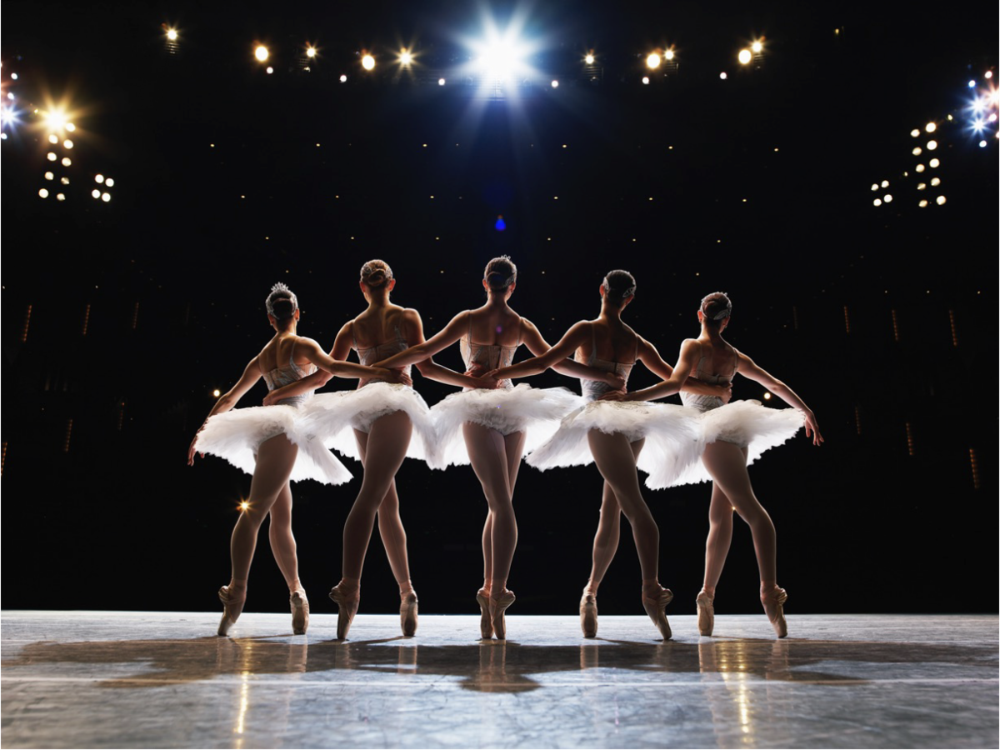
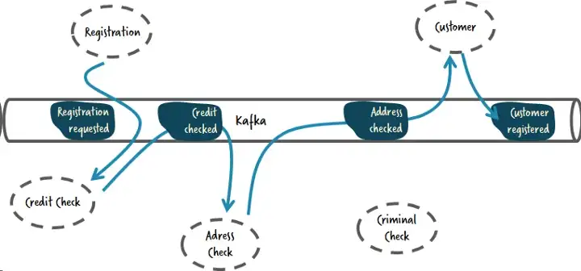
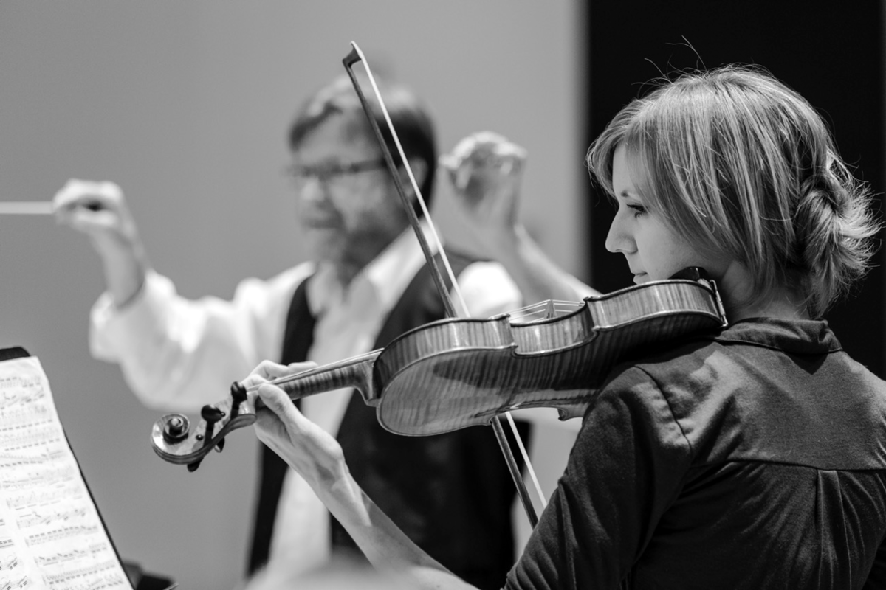
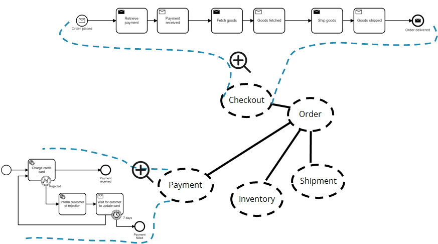
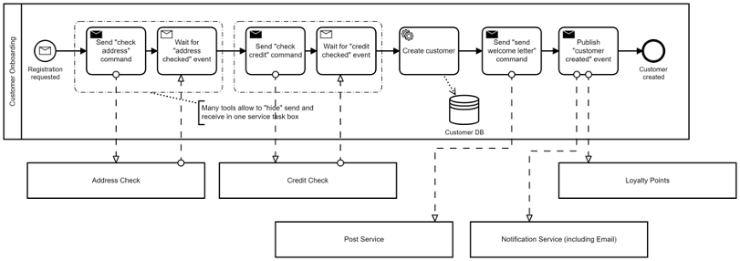

## Оркестрация и хореография микросервисов

Прежде чем мы сможем говорить о преимуществах, недостатках и применении, нам нужно понять, в чем именно различия между этими двумя подходами. Давайте рассмотрим их определения и попытаемся выявить сильные и слабые стороны каждого из них.

### Что такое Хореография 

В балете кажется, что все двигаются гармонично и будто сами по себе, без управления. В IT-архитектуре хореография описывает модель координации и организации взаимодействия между различными компонентами или системами. Это шаблон проектирования, который позволяет разрабатывать распределенные системы, в которых компоненты взаимодействуют друг с другом через набор четко определенных интерфейсов, без необходимости центрального авторитета или координатора.

Система, организованная по хореографии, по определению использует событийную связь, в то время как оркестрация микросервисов использует командную. Событие — это что-то, что произошло в прошлом и является фактом. Отправитель не знает, кто подхватит событие и что за этим последует. Примером может служить событие "Проверка кредита".

На рисунке ниже показана хореографированная событийно-управляемая архитектура микросервисов типичного процесса регистрации клиента. Она включает в себя микросервисы для регистрации, кредита, проверки адреса и криминальной истории. Каждый из них управляется через события, которыми они обмениваются через брокер сообщений (например, Kafka).

####  Преимущества хореографии

После того как мы разъяснили сам термин, ближе рассмотрим преимущества использования хореографии в архитектуре микросервисов:

- **Loose coupling**: Хореография позволяет микросервисам быть почти автономными модулями, что означает, что они могут работать независимо и асинхронно без участия координатора, делая систему более масштабируемой и устойчивой, поскольку сбой одного микросервиса не обязательно повлияет на другие.
- **Простота обслуживания:** Хореография позволяет разрабатывать и поддерживать микросервисы независимо, что упрощает обновление и развитие системы.
- **Децентрализованное управление** позволяет повысить устойчивость системы к отказам.
- **Асинхронное взаимодействие:** Хореография позволяет микросервисам обмениваться сообщениями асинхронно, что может быть эффективнее, чем синхронное взаимодействие.

В целом, хореография может быть полезным шаблоном проектирования для создания масштабируемых, устойчивых и поддерживаемых систем. Однако некоторые из этих преимуществ могут превратиться в недостатки.

#### Недостатки хореографии

- **Сложность**: Хореография может быть более сложной для реализации и поддержки, чем оркестрация, поскольку требует разработки четко определенных интерфейсов и мониторинга взаимодействий между микросервисами.
- **Отсутствие контроля**: Без центрального координатора сложнее отслеживать и управлять взаимодействием между микросервисами в системе.
- **Непрозрачность**: Может быть затруднительно оценить состояние системы как целого.
- **Сложности при отладке**: Без центра управления отладка проблем в системе, организованной по хореографии, оказывается более трудоемкой. Так называемые цепочки событий могут легко возникать, когда для определенной области требуется несколько сервисов. Эти цепочки обычно не видны, что усложняет поиск ошибок.

### Что такое Оркестрация

Оркестрация – это комплекс управляющих инструментов, ответственных за координацию различных компонентов или систем.

В оркестрируемой системе используется командное взаимодействие. По сравнению с событием, команда имеет намерение. Отправитель хочет, чтобы что-то произошло, и получатель не обязательно знает, кто отдал команду.

Возьмем пример процесса управления заказами, который включает этапы оформления, оплаты, доставки и управления запасами. Для этого нам нужно добавить общий сервис заказа, который заботится об оркестрации

#### Преимущества оркестрации

Оркестрация в микросервисной архитектуре дает ряд преимуществ, которые компенсируют недостатки хореографической системы:

- **Простота** в разработке и сопровождении
- **Централизованное управление** означает и однонаправленный поток данных о системе, что делает мониторинг прозрачнее
- Отсюда, оркестрация позволяет **адекватно** оценивать системы
- В **отладке** возникает меньше подводных камней

#### Недостатки оркестрации

- **Tight coupling**: Оркестрацию часто ругают за повышенную *когезию* компонент, что тормозит масштабирование.  Но это во многом устраняется, если использовать асинхронное взаимодействие как в хореографии
- **Одна точка отказа**: Координатор в такой системе может быть узким горлышком, в этом случае стоит заранее предусмотреть разворачивание оркестратора в режиме высокой доступности.

### Когда использовать оркестрацию, когда – хореографию

Рассмотрим конкретные сценарии применения каждого подхода

#### Сценарии хореографии

Идеальный сценарий для использования событийного взаимодействия – это когда сообщение покидает контекст текущего домена. Возьмем, например, процесс привлечения клиента. Онбординг может произойти при подписке на рассылку или бонусную программу. Это происходит вне основного контекста привлечения клиентов, и нам не обязательно ждать возвращения события, чтобы продолжить общий процесс. Следовательно видимость в этой области не требуется.

Этот подход особенно полезен если:

- вы хотите избежать создания единой точки отказа или узкого места в системе
- вы хотите предоставить микросервисам больше автономии и независимости
- вы хотите сделать добавление или удаление сервисов из системы более простым, не нарушая общего потока коммуникации.

#### Сценарии использования оркестрации

Когда между доменами ваших сервисов возникают общие процессы, оркестрация – это путь к успеху. Бизнес-возможности требуют нескольких сервисов, которые зависят друг от друга. Оркестрация облегчает поддержание видимости и помогает устранению неполадок в системе в случае ошибки. Особенно, если речь идет о сложной архитектуре с десятками сервисов, это обычно приводит к очень устойчивому подходу.

Использование оркестрации особенно полезно, когда

- необходимо гарантировать определенный порядок выполнения микросервисами своих задач
- нужно вручную управлять жизненным циклом микросервисов, вроде запуска и остановки
- у вас сложная система с множеством взаимозависимых микросервисов, и вам нужно обеспечить оптимальную работу каждого сервиса, а также координированную работу всех вместе.

#### Комбинирование хореографии оркестрации

Сочетание хореографии и оркестрации в микросервисной архитектуре может оказаться полезным. Хореография добавляет гибкости и автономии взаимодействиям. Это может помочь создать менее централизованную и устойчивую систему. С другой стороны, оркестрация упрощает сопровождение и контроль. Объединяя оба подхода, можно добиться плюсов от обеих сторон

