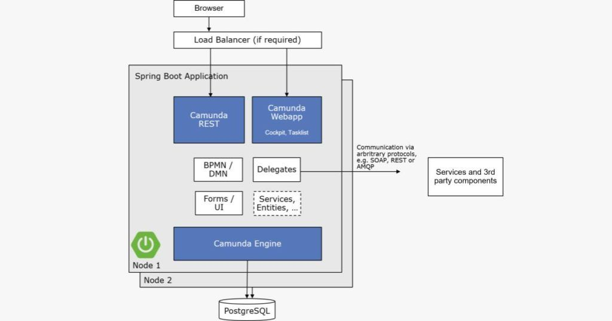
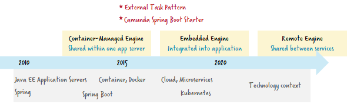
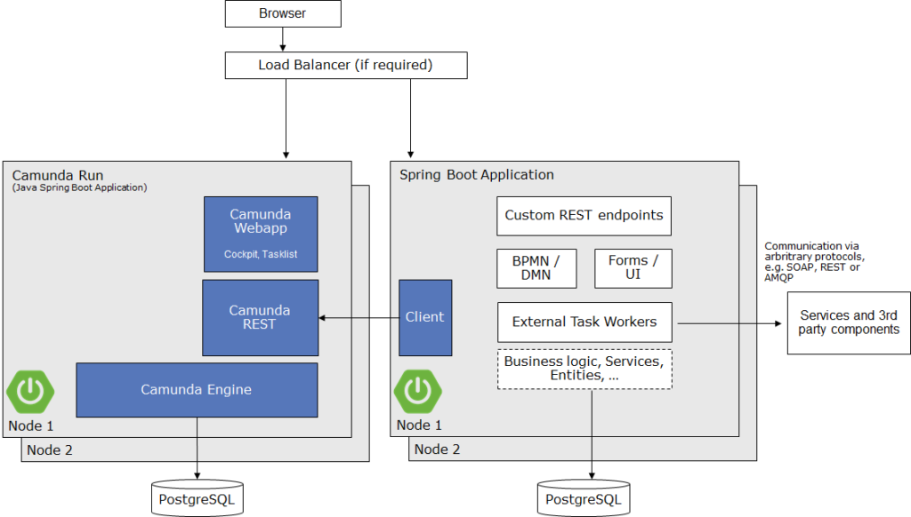
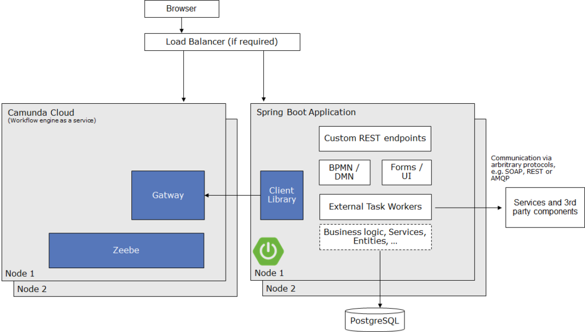

## Рекомендации вендора по архитектуре системы

Текст ниже – сокращенная версия статьи **Camunda**, затрагивающей вопрос использования отдельностоящего или встроенного движка. [Оригинал](https://camunda.com/blog/2022/02/moving-from-embedded-to-remote-workflow-engines/)

### Немного истории

В 2012 году серверы приложений Jakarta EE были популярны, и Jakarta EE все еще назывался J2EE. Большинство Java-приложений развертывались на таких серверах. С **Camunda** мы осознанно обеспечивали интеграцию с этими технологиями и основной моделью использования тогда было встраивание процессного движка в код приложения (*embedded engine*)

Но был и **Spring**, противопоставленный J2EE. Spring запускали на Tomcat. Хотя на Tomcat реализован контейнерный движок, оказалось, что пользователям не нравится возиться с самой установкой Tomcat, они самостоятельно создавали среду разворачивания приложения (включая встроенный рабочий процесс).

Хотя это была популярная модель, у нее были некоторые проблемы. Например, проблемы с загрузкой классов при развертывании приложения рядом с веб-приложениями Camunda. Многие не могли разобраться в сложных  конфигах Tomcat. Все это привело к возникновению Spring Boot, где приложение полностью самодостаточно. Это также совпало с идеями о микросервисах и ростом популярности контейнеров.

Около 2015 года [группа энтузиастов](https://github.com/camunda/camunda-bpm-spring-boot-starter/graphs/contributors) создала **Spring Boot Starter** для Camunda, который уже в 2017 году был включен в [официальный релиз](https://camunda.com/blog/2017/11/camunda-spring-boot-starter-230-released/). Скоро это стало стандартом по умолчанию для новых проектов. Типичная архитектура выглядела как [наша рекомендация для зеленого поля](https://docs.camunda.io/docs/components/best-practices)

Но в то же время были внедрены [внешние задачи](https://camunda.com/blog/2015/11/external-tasks/) – **External Tasks**. Один из важных факторов их успеха заключался в том, что большинство процессных решений в то время становились более сложными и уже не являлись единым самодостаточным приложением. Скорее, они оркестрировали удаленные конечные точки выполнения процедур и становились частью распределенной системы (например, в архитектуре микросервисов). В последние месяцы мы приложили некоторые усилия, чтобы сделать [внешние задачи](https://camunda.com/blog/2021/03/external-task-client-spring-bootified/) моделью программирования по умолчанию, даже если мы все еще [не хватает некоторого удобства](https://github.com/camunda-community-hub/camunda-engine-rest-client-java/). 

Использование функционала внешних задач, нивелирует неудобства в коммуникации, возникающие модели с отдельностоящим движком 

В 2020 году мы создали дистрибутив нацеленный конкретно на эту задачу – [Camunda Run](https://camunda.com/blog/2020/03/introducing-camunda-bpm-run/). Идея заключалась в создании самодостаточного BPM, который можно было бы легко настроить в Docker или Kubernetes, без необходимости понимать Java. Это позволяет запускать его как сервис. Многие крупные клиенты уже внедряют этот подход в своих внутренних проектах

### Текущие рекомендации

Теперь мы переходим от нашего рекомендованного по умолчанию подхода для **Camunda Platform 7** к использованию [удаленного движка](https://docs.camunda.org/manual/latest/introduction/architecture/?__hstc=252030934.32f4f3b7c9ed4fd02992155ddf4ecee5.1707759185685.1707773416138.1707777509406.4&__hssc=252030934.1.1707777509406&__hsfp=751191883#standalone-remote-process-engine-server), более конкретно к Camunda Run, в качестве рабочего процесса, внешних задач и REST API (обычно обернутого в клиент для вашего языка программирования). Если вы разрабатываете на Java, вам может быть полезным [этот дополнительный инструмент от сообщества](https://github.com/camunda-community-hub/camunda-engine-rest-client-java/). Предстоящее рекомендуемое стековое решение для новых проектов будет выглядеть следующим образом:

Этот стек также близок к тому, что вы бы использовали в Camunda Platform 8:

Подход с отдельным движком существенно облегчает переключение между этими двумя стеками. Вы позволяете своей организации сосредоточиться на одном архитектурном стиле, и если когда-нибудь в будущем подумаете о [миграции с Camunda Platform 7 на Camunda Platform 8](https://docs.camunda.io/docs/guides/migrating-from-Camunda-Platform/#prepare-for-smooth-migrations), такой подход позволит осуществить переход с гораздо меньшими усилиями.

Далее давайте рассмотрим плюсы и минусы встраиваемого движка с учетом сегодняшней ситуации.

  ### Недостатки встроенного движка

Давайте рассмотрим конкретные проблемы, с которыми мы сталкивались ранее с встраиваемым движком, выявляющие слабые места этой модели:
- **Отсутствие изоляции** между движком и приложением, что означает:
    - **Усложнение отладки**: Нередко случались ситуации, когда всем в команде сопровождения приходилось тратить значительное время для изучения текущей архитектуры и конфигурации, что не только потребляло ресурсы с обеих сторон, но и затрудняло решение проблемы. Проблемы не всегда локализованы конкретно в движке или коде приложения – они могут возникать на стыке.
    - **Смешивание библиотек**: Приложение автоматически подтягивает все зависимости BPM-движка , что может привести к конфликтам версий, которые не всегда легко разрешить.
    - **Снижение стабильности**: Приложения, встраивающие Camunda, имели массу возможностей изменять поведение основного движка. Это могло влиять на стабильность ядра движка или внести уязвимости, которые трудно диагностировать.
    - **Необходимость пересборки и повторного развертывания**: Изменения в конфигурации движка или обновление версии (даже патч-версий) требовали полной пересборки приложения.

- **Сложные конфигурации**: Хотя это удобно, что вы можете влиять на потоки исполнения движка, это также делает все процессы настройки сложнее, предоставляя слишком большой выбор. А использовании нескольких движков, например, в больших организациях, им часто требуется разные настройки.
- **Отсутствие полиглотных сред**: Встроенные движки могут поддерживать только один язык программирования. В случае Camunda этим языком является Java. Современные архитектуры намного более полиглотны и должны в теории поддерживать допускать использование разных языков программирования.

### Преимущества удаленного движка

Удаленный движок имеет несколько преимуществ, в основном направленных на решение вышеупомянутых недостатков:

- **Разрыв связи:** Рабочий процесс движка настраивается и настраивается независимо от приложения и решения по обработке. Проблемы могут легко определяться в одном из компонентов, и уязвимости не распространяются на другие компоненты.
- **Улучшенные шаблоны масштабирования:** Рабочий процесс движка может масштабироваться независимо от кода приложения. Camunda может оптимизировать производительность ядра движка, поскольку имеет полный контроль над тем, что запускается в этой области.
- **Разрешение программного обеспечения как услуги (SaaS)**: Рабочий процесс движка может работать как служба для вас, либо в общедоступном облаке (как Camunda Platform 8), либо, возможно, как внутренняя служба (как это делают наши клиенты). При этом вы можете разрабатывать свое приложение локально или на собственной инфраструктуре, поскольку приложения могут удаленно подключаться к рабочему движку.
- **Более простой опыт начала работы**: Вы можете настроить движок с помощью простой команды Docker и не заниматься настройкой в своем собственном приложении.

Чтобы поделиться анекдотом, давайте рассмотрим доказательство концепции, которое произошло в крупном автомобильном производителе две недели назад. Они использовали Apache Kafka и MongoDB. Для них было естественным иметь файл Docker Compose для запуска необходимых ресурсов, поэтому добавление двух строк для запуска Camunda тоже казалось абсолютно правильным. Затем они могли распределять работу. Сотрудник по инфраструктуре изучил подключение Camunda к их выбранной PostgreSQL и настройку некоторых вопросов безопасности, в то время как разработчики начали моделировать и выполнять процесс BPMN.

Удаленный движок требует использования внешнего шаблона задачи, что приводит к дополнительным преимуществам просто применением внешнего шаблона задачи:

- **Временное разрывание связи:** Ваш склеивающий код (то, что мы называем воркерами), может быть офлайн в течение некоторого времени; работа от рабочего движка просто будет ожидать его возврата. Вы получаете это временное разрывание без необходимости использования брокера сообщений.
- **Полиглотные архитектуры (непривязанные к Java средам)**: [Java Delegates](https://docs.camunda.org/manual/latest/user-guide/process-engine/delegation-code/?__hstc=252030934.32f4f3b7c9ed4fd02992155ddf4ecee5.1707759185685.1707773416138.1707777509406.4&__hssc=252030934.1.1707777509406&__hsfp=751191883#java-delegate) работают только в Java, но внешние задачи позволяют использовать все языки с помощью REST.
- **Отделение реализации воркера**: Воркер является собственным программным компонентом и никак не связан с рабочим движком. Это означает, что он может контролировать множество аспектов самостоятельно. Например, если вам нужно выполнить задачу службы, занимающую несколько часов (например

### Некоторые мифы о удаленных движках

Вам может быть интересно ознакомиться с [“Как писать склейку без Java Delegates в Camunda Platform 8”](https://blog.bernd-ruecker.com/how-to-write-glue-code-without-java-delegates-in-camunda-cloud-9ec0495d2ba5), опровергающим некоторые распространенные мифы, связанные с работой с внешними задачами в настройке удаленного движка:

- Вы все еще можете вызывать свои служебные точки доступа через любой протокол (например, REST, AMQP, Kafka).
- Весь код воркера может находиться в одном Java-приложении.
- Модель программирования выглядит удивительно схожей с JavaDelegates при использовании Spring.
- Обработка исключений по-прежнему может быть делегирована в рабочий движок.
- Дополнительная нагрузка на производительность в терминах задержки не очень велика.

### Проблемы удаленного движка

Конечно, у разработчиков также возникают типичные проблемы при настройке удаленного движка. Давайте рассмотрим их и как они обычно решаются.

- **Удобство в модели программирования**: Удаленное взаимодействие через REST или gRPC менее удобно для разработчиков, чем простое использование библиотеки клиента на их языке программирования. Это можно смягчить, предоставив соответствующие библиотеки клиентов, которые скрывают детали удаленного взаимодействия, например, как это делает Zeebe, например [для Spring](https://github.com/camunda-community-hub/spring-zeebe/), [Java или другие](https://docs.camunda.io/docs/apis-clients/java-client/index/). [“Как писать склейку без Java Delegates в Camunda Platform 8”](https://blog.bernd-ruecker.com/how-to-write-glue-code-without-java-delegates-in-camunda-cloud-9ec0495d2ba5) дает вам хороший обзор того, что я имею в виду.
- **Транзакции в удаленном взаимодействии**: С удаленным движком вы не можете использовать общие транзакции между своим кодом и рабочим движком. Я посвятил этой теме статью в блоге, [“Достижение согласованности без менеджеров транзакций”](https://blog.bernd-ruecker.com/moving-from-embedded-to-remote-workflow-engines-8472992cc371)
- **Запуск отдельного ресурса**: Удаленный движок – это собственный ресурс, программа или контейнер, который вам нужно обслуживать для работы вашего собственного приложения. Благодаря облачным сервисам или Docker, это можно решить очень легко сегодня, и это кажется менее проблематичным, чем было лет назад. Вы также можете просто загрузить и распаковать рабочий движок локально и запустить его на своем собственном компьютере, вам просто нужно установить Java.
- **Написание модульных тестов**: Есть специфическая проблема; вы хотите, чтобы модульные тесты запускались автономно, без какой-либо зависимости от окружения. Это можно решить в целом с помощью проекта [Testcontainers](https://www.testcontainers.org/), но, например, Zeebe также предоставляет “мини-движок”, который можно запустить во время выполнения в тесте JUnit, полностью устраняя эту проблему в мире Java. Обратитесь к [zeebe-process-test](https://github.com/camunda-cloud/zeebe-process-test/) для получения дополнительных сведений. Другие языки программирования могут последовать.